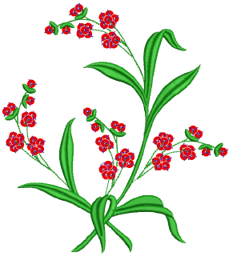

# Sequin Embroidery

Some embroidery machines are equipped with devices that can drop sequins onto the garment as it stitches. EmbroideryStudio allows you to digitize sequin designs for compatible machines. There is also a dedicated tool for automatically converting sequin artwork to sequin runs.

This section describes how to set up sequin palettes and how to visualize sequin designs. It explains how to create single-sequin as well as multi-sequin runs. It also covers sequin fixings as well as reshaping and editing.

## Related topics...

- [Selecting sequin mode](Selecting_sequin_mode)
- [Visualizing sequin designs](Visualizing_sequin_designs)
- [Digitizing sequin runs](Digitizing_sequin_runs)
- [Sequin fixings](Sequin_fixings)
- [Creating multi-sequin runs](Creating_multi-sequin_runs)
- [Editing sequin runs](Editing_sequin_runs)
