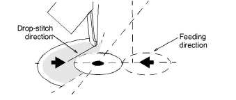
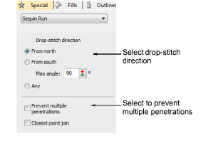
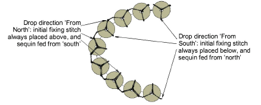
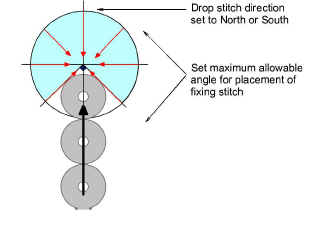
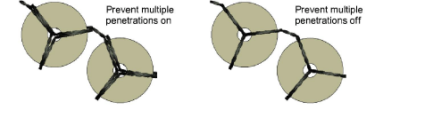

# Set drop-stitch direction

There is an option to ensure that the initial fixing stitch before the sequin drop is placed opposite the feeding direction, as recommended by the machine manufacturer. Otherwise, the sequin may be deflected by the thread. If the needle then misses the center of the sequin because of incorrect placement, the embroidery material, needle or needle plates may be damaged. In multihead machines, sequins are fed from the front or ‘south’ which means that the initial fixing stitch or ‘drop stitch’ should be placed on the ‘north’ side (the default). In Schiffli machines, the opposite is the case.

## To set the drop-stitch direction...

1. Select a sequin-run object and double-click to access object properties.

2. Select the drop-stitch direction to ensure that the initial fixing stitch is opposite the feeding direction:

| Drop-stitch direction | Feeding direction                                            |
| --------------------- | ------------------------------------------------------------ |
| From north            | Front or ‘south’ – which is the case in multihead machines.  |
| From south            | The top or ‘north’ – which is the case in Schiffli machines. |

Caution: With the Any option, direction is not important. This option generates the least number of fixing stitches but may not be suitable for your sequin device. Check your machine documentation.

3. Enter a Max Angle to specify an angular range within which drop-stitch will fall.

You can set the value for either north or south fixing stitches. The default is 90° but this can be increased or decreased depending on the capabilities of your machine.

4. Select the Prevent multiple penetrations option as required.

This option is used to minimize penetrations at the same point, and to generate Schiffli-compatible fixing stitching. If you select the Schiffli template, the option is ‘on’ by default. When set to ‘off’, some fixing stitches will have multiple penetrations at the same point, both at the sequin center and outer edge.

5. Select the Closest point join option as required.

By default, this option is off, meaning that the system connects the exit leg of the fixing stitch motif, wherever it happens to be, to the entry leg of the next fixing stitch motif, again wherever it happens to be. That is, unless the connector exceeds the maximum sequin stitch. Choose the Closest point join option if you want to always connect fixing stitch motifs from the leg closest to the nearest leg of the next fixing stitch motif.
