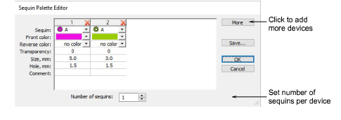
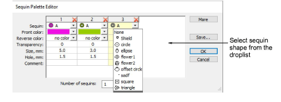
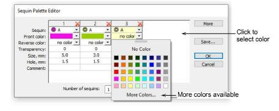
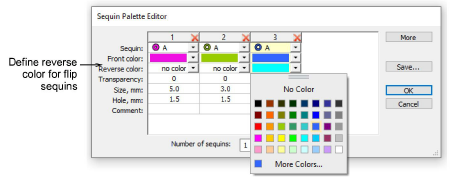
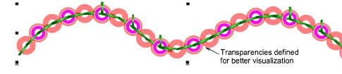
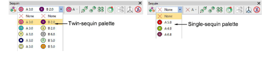
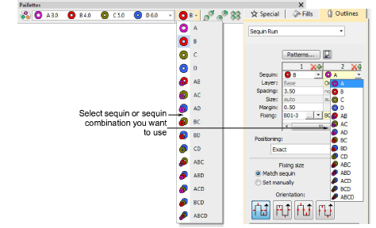

# Setting up sequin palettes

|              |                                                                                                                | Use Sequin > Sequin Palette to select from a default or user-defined palette of sequin shapes for the current design. |
| ---------------------------------------------------------- | -------------------------------------------------------------------------------------------------------------- | --------------------------------------------------------------------------------------------------------------------- |
|  | Use Sequin > Sequin Palette Editor to select shapes from a sequin library, and define sequin colors and sizes. |                                                                                                                       |

The Sequin Palette Editor lets you prepare a palette of sequins according to capabilities of your chosen machine. The palette editor lets you define as many devices as your machine supports or you require for the design. Choose sequins from a library of predefined shapes or define your own. Once set up, the palette is available for use from the Sequin toolbar and Object Properties.

## To set up a sequin palette...

1. Select the machine format that supports the machine you are using or the design type you want to create.

2. Click the Sequin Palette Editor icon. Fields are arranged so that parameters for each sequin can be viewed at once.

3. Set the number of sequins available per device. Depending on machine type, up to eight (8) sequins may be supported. If you have chosen a twin-sequin machine, this value is limited to 2.

4. Use the More button to add devices. Click X in the column header to remove.

Typical configurations include:

| Device                           | Configuration |
| -------------------------------- | ------------- |
| 1 x Single sequin                | A             |
| 2 x Single sequin                | A / A         |
| 1 x Twin sequin                  | AB            |
| 2 x Twin sequin                  | AB / AB       |
| 1 x Double twin (Dahao)          | ABCD          |
| 2 x Double twin (Dahao)          | ABCD / ABCD   |
| 1 x Multi-sequin (6, 8, 12, etc) | ABCDEF...     |

::: info Note
Typically the machine operator will use Needle 1 to position the starting point. Thus single devices are usually mounted on the last needle. In terms of software configuration, it makes no difference.
:::

5. Select predefined or custom sequin shapes from the droplist.

6. Set color and size for each sequin as well as hole size. Colors can be defined for front and reverse sides as well as a transparency factor for translucent sequins.

7. If you are using reversible or ‘flip’ sequins, define the reverse color as well. Flip sequins are generally used with twin- or multi-sequin machines, but may be used on their own.

8. If you are using transparent sequins, define a transparency factor from 0 to 90 for each sequin.

- Click OK. Sequins are available for selection.

- Permutations for sequin stacks are automatically calculated and displayed in the Manual Sequin droplist and Object Properties.

::: tip
The digitizer needs to know the machine capabilities by heart. If an unsupported combination is selected – e.g. four sequin stack feeding – the drop code is ignored on the machine.
:::

## Related topics...

- [Select sequin-capable machines](Select_sequin-capable_machines)
- [Creating multi-sequin runs](Creating_multi-sequin_runs)
