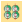
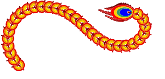
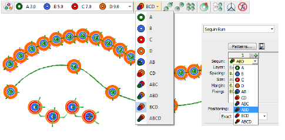

# Stacked sequins

|                  | Use Sequin > Manual Sequin to digitize individual sequins.                                                       |
| ------------------------------------------------------------ | ---------------------------------------------------------------------------------------------------------------- |
|      | Use Sequin > Sequin Run Auto to create a string of sequins along a digitized line according to current settings. |
|  | Use Sequin > Sequin Run Manual to manually digitize sequin-drops along a digitized line.                         |
|                      | Use Sequin > Sequin Fill to digitize and fill large, irregular shapes with sequins.                              |

For those machines that support it, EmbroideryStudio allows you to define multiple sequin drops on the same needle.

Stacked sequins can be used with Manual Sequin and Sequin Run digitizing methods. Permutations are automatically defined according to the sequin palette.

For those machines that support it, fixing stitches are only applied after all sequins have been dropped. In the case of many twin-sequin machines, the first sequin is dropped, fixed in place, and another dropped on top and stitched again.

::: info Note
If you choose a stacked sequin configuration that the sequin device does not support, the machine will simply ignore that particular drop code.
:::

## Related topics...

- [Setting up sequin palettes](Setting_up_sequin_palettes)
- [Digitizing sequin runs](Digitizing_sequin_runs)
- [Digitize sequin drops with fixings](../sequin_advanced/Digitize_sequin_drops_with_fixings)
