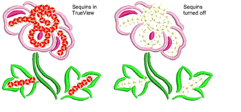
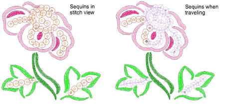

# Visualizing sequin designs

|            | Click View > TrueView to toggle between stitch view and TrueView™. Right-click for settings.      |
| ---------------------------------------------- | -------------------------------------------------------------------------------------------------- |
|    | Use View > Show Stitches to toggle embroidery stitching display. Right-click for settings.         |
|  | Use View > Show Functions to toggle display of machine function symbols. Right-click for settings. |

Sequins can be viewed in TrueView or stitch view while Show Functions is toggled on.

Both sequins and fixing stitches appear in their selected colors and can be turned on or off via Show Functions and Show Stitches toggles.

When traveling through a sequin design, ‘undropped’ sequins appear in the ‘unsewn’ color defined in the Background & Display Colors dialog.

Tip: The Show Repeats function displays repeating designs, including sequins, in both TrueView and stitch view. You can view a design, even while digitizing, with any number of repeats.

## Related topics...

- [Travel through designs](../../Basics/view/Travel_through_designs)
- [Viewing design repeats](../../Basics/view/Viewing_design_repeats)
- [Change display colors](../../Basics/view/Change_display_colors)
