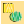
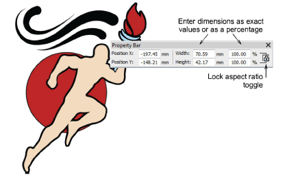
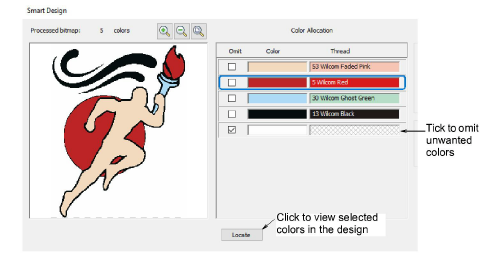
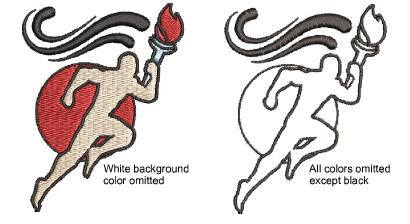
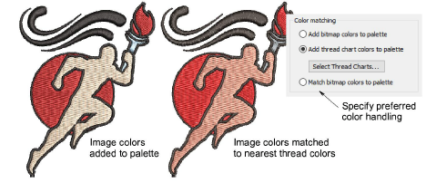
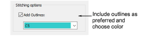
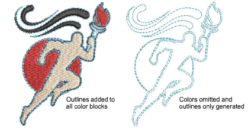

# Auto-digitize entire designs

|                  | Use Auto-Digitizing > Smart Design to create embroidery designs directly from imported artwork. |
| -------------------------------------------------------------------- | ----------------------------------------------------------------------------------------------- |
|  | Use Auto-Digitizing > Keep Graphic Objects to retain original artwork during conversion.        |

For more control over object conversion, use the Smart Design method. This can recognize shapes in artwork and allow you to preset suitable stitch types for conversion. Smart Design determines stitching sequence based on closest join. [Artwork](../../glossary/glossary) is effectively ‘batch processed’ to create the many embroidery objects that make up a design. The tool handles both [bitmap](../../glossary/glossary#bitmap) and [vector](../../glossary/glossary) formats.

## To auto-digitize entire designs...

1. Load and preset the artwork as necessary.

2. Select the image and click Smart Design.

If the image requires preprocessing, the software displays the Prepare Bitmap Colors dialog. [See Preparing images for auto-digitizing for details.](../bitmaps/Preparing_images_for_auto-digitizing)

Next, the Smart Design dialog opens. Image colors are automatically sequenced and backgrounds omitted altogether.

3. Use the Color Allocation panel to omit unwanted colors. Use the Locate button to isolate selected colors.

4. Select a conversion method for color processing. By default, bitmap colors are added to the current [colorway](../../glossary/glossary). Optionally, select a specific thread chart to match to or match colors to the current palette.

5. Optionally, add outlines to all detected shapes. Tick Add outlines and select a palette color from the droplist. This has the effect of reinforcing all color blocks with continuous, branched running stitches.

6. Click OK to process the image.

7. Edit object properties as preferred, including colors, stitch types, and so on. Even convert run outlines to satin borders.

- Use the Color-Object List and/or Sequence toolbar to optimize the stitch sequence of your auto-digitized objects.
- Use the Closest Join and/or the Reshape tool to minimize connectors.
- Toggle underlays on/off with the Auto Underlay button.

## Related topics...

- [Loading & presetting artwork](Loading_presetting_artwork)
- [Crop bitmap images](../bitmaps/Crop_bitmap_images)
- [Preparing images for auto-digitizing](../bitmaps/Preparing_images_for_auto-digitizing)
- [Sequencing embroidery objects](../../Modifying/combine/Sequencing_embroidery_objects)
- [Reshaping embroidery objects](../../Modifying/reshape/Reshaping_embroidery_objects)
- [Merge vector & embroidery objects](../../Modifying/reshape/Merge_vector_embroidery_objects)
- [Minimizing connectors](../../Quality/connectors/Minimizing_connectors)
- [Stabilizing with automatic underlay](../../Quality/underlays/Stabilizing_with_automatic_underlay)
