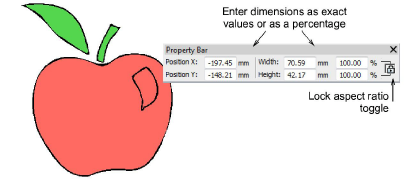
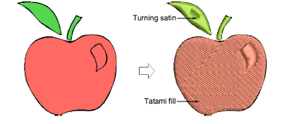
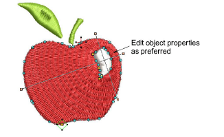
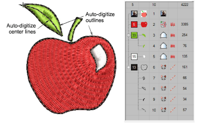

# Auto-digitize individual shapes

|                  | Use Auto-Digitizing > Color Matching Method to preselect a thread matching method.                                   |
| -------------------------------------------------------------------------- | -------------------------------------------------------------------------------------------------------------------- |
|                                | Use Auto-Digitizing > Turning Satin Object to fill narrow column shapes with turning stitch angles.                  |
|                                    | Use Auto-Digitizing > Tatami Fill Object with Holes to fill large areas with tatami stitching, preserving any holes. |
|  | Use Auto-Digitizing > Tatami Fill Object to fill large areas with tatami stitching, ignoring any holes.              |
|                                    | Use Auto-Digitizing > Centerline Run Object to create centerlines in narrow shapes with run stitching.               |
|                                    | Use Auto-Digitizing > Outline Run Object to create outlines of run stitching.                                        |

The Auto-Digitizing tools provide everything necessary to automatically digitize shapes in electronic [artwork](../../glossary/glossary#artwork) – both [bitmap](../../glossary/glossary#bitmap) and [vector](../../glossary/glossary) – without using manual digitizing methods. These tools are useful for turning scanned images into embroidery designs that do not require particular artistic effects or embroidery-specific knowledge. If you are using a [vector](../../glossary/glossary) graphic, it must include a fill color. Auto-Digitizing can be used to create tatami fills as well as objects with turning satin. Use it also to digitize outlines and details with run stitching. [Current properties](../../glossary/glossary) are applied.

## To auto-digitize individual shapes...

1. Load and preset the artwork as necessary.

2. Select an auto-digitizing fill method:

- Use Tatami Fill Object with Holes for large areas, preserving any holes within them.
- If you want holes ignored, use Tatami Fill Object.
- Use Turning Satin Object to digitize narrow turning shapes with satin stitch.

3. Click the shapes you want to digitize. Stitches are generated according to current settings.

4. Optionally, edit object properties, including colors, stitch angles, entry/exit points and so on.

## To auto-digitize outlines and details...

1. Select an auto-digitizing outline method:

- Use Centerline Run Object to create centerlines in narrow shapes with run stitching.
- Use Outline Run Object to create outlines of run stitching.

2. Again click the shapes you want to digitize. Stitches are generated according to current stitch settings.

## To edit the result...

- Edit the result as preferred – e.g. change colors, change stitch types, delete any unwanted background stitching, etc.
- Use the Color-Object List and/or Sequence toolbar to optimize the stitch sequence of your auto-digitized objects.
- Use the Closest Join and/or the Reshape tool to minimize connectors.
- Toggle underlays on/off with the Auto Underlay button.

## Related topics...

- [Loading & presetting artwork](Loading_presetting_artwork)
- [Crop bitmap images](../bitmaps/Crop_bitmap_images)
- [Preparing images for auto-digitizing](../bitmaps/Preparing_images_for_auto-digitizing)
- [Sequencing embroidery objects](../../Modifying/combine/Sequencing_embroidery_objects)
- [Reshaping embroidery objects](../../Modifying/reshape/Reshaping_embroidery_objects)
- [Merge vector & embroidery objects](../../Modifying/reshape/Merge_vector_embroidery_objects)
- [Minimizing connectors](../../Quality/connectors/Minimizing_connectors)
- [Stabilizing with automatic underlay](../../Quality/underlays/Stabilizing_with_automatic_underlay)
