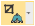
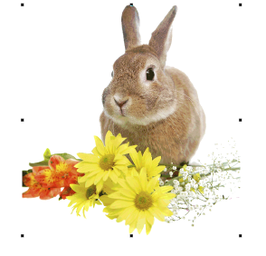
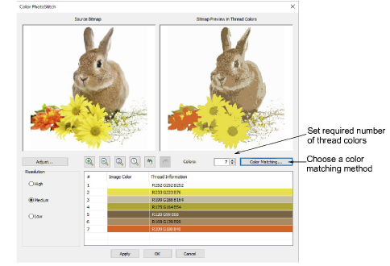
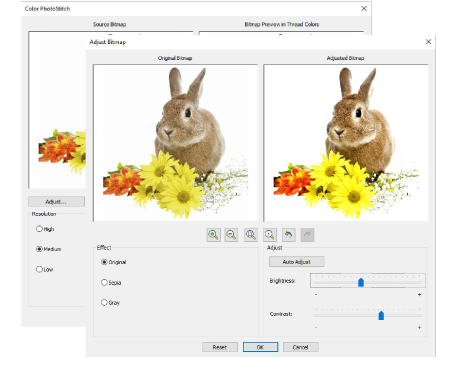
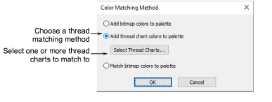
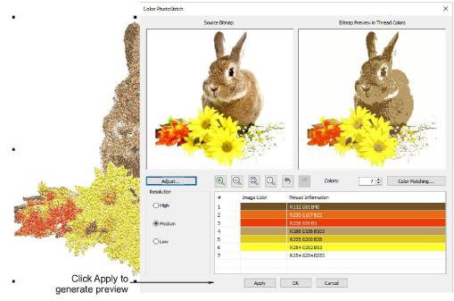
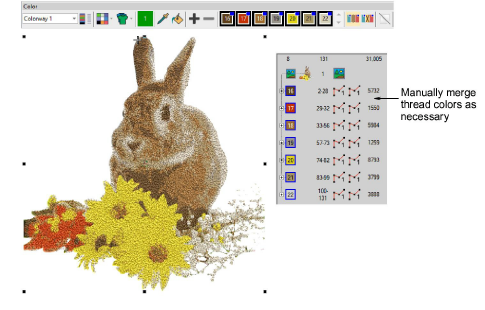

# Auto-digitize with Color PhotoStitch

|                  | Use Standard > Import Graphic to import artwork into current design as a backdrop for manual or automatic digitizing.             |
| -------------------------------------------------------------- | --------------------------------------------------------------------------------------------------------------------------------- |
|                      | Use View > Show Bitmaps to toggle bitmap images on or off. Right-click for settings.                                              |
|                | Use Auto-Digitizing > Crop Bitmap to crop bitmap artwork for use with auto-digitizing.                                            |
|                    | Use Auto-Digitizing > Adjust Bitmap to adjust image lightness and contrast in preparation for auto-digitizing.                    |
|  | Use Auto-Digitizing > Color PhotoStitch to automatically turn photographs and other bitmap artwork into multi-colored embroidery. |

Use Color PhotoStitch to create embroidery from photographs and other images. While Photo Flash designs consist of rows of single-color satin stitching, Color PhotoStitch produces variegated stitching using multiple thread colors. The overall effect is like multi-colored stippling.

## To process the image...

1Insert the bitmap image in your design and scale it to the required size.

2Crop the image as desired using the Crop Bitmap tools.

3With the image selected, click Color PhotoStitch.

Note: Support is provided for transparent backgrounds in 24 bit and 32 bit images.

4Set the number of thread colors. There will be a point a diminishing returns where more colors do not always result in greater design clarity or stitchability. Usually 7 to 10 colors produce the best results.

5Use the zoom buttons to examine the previews in detail. You can also zoom in and out with the mouse wheel.

6Optionally, adjust stitching resolution to high, medium, or low. High resolution allows greater detail but with a higher stitch count.

7Click Adjust Bitmap for further options:

- Click Auto Adjust to allow the software to optimize image settings for automatic digitizing.
- Use Brightness and Contrast settings to further differentiate darker and lighter areas of stitching.
- Click Reset to return adjusted settings to default image settings.

8Choose between several image variations:

| Option | Function                                                                                                                                                                             |
| ------ | ------------------------------------------------------------------------------------------------------------------------------------------------------------------------------------ |
| Sepia  | In photographic terms, ‘sepia’ refers to the dark-brown color of old-fashioned prints. Originally the process involved adding a pigment made from cuttlefish ink during development. |
| Gray   | Grayscale images are ones composed exclusively of shades of gray, varying from black at the weakest intensity to white at the strongest.                                             |

9Use Color Matching to assign image colors to the color palette for manual thread matching. This ensures the best representation. Alternatively, automatically match them to the current color palette or current thread chart. Select one or more available thread charts to match to.

10Use Apply to generate temporary stitching without closing the dialog. Further adjust settings until you obtain the result you want and click OK to confirm.

## To edit the result...

- Check the results with TrueView™ on and off. Turn connector stitching on and off. For better visualization, set TrueView™ viewing options to thin thread.

If you are unsatisfied with the results, click Undo and try again. Try different settings and check the previews. You may need to touch up the image in PHOTO-PAINT if none of the results is good enough.

- Edit the results and manually merge thread colors as necessary using the Color-Object List.

- If you have added RGB colors to the color palette, open the Color-Object List and Threads dockers side-by-side, and select the thread charts you have available from the Select Thread Charts dialog.

Select each color block in turn, check the closest match in Threads docker, and manually choose a thread. Sometimes the closest match may not be the best or be unavailable. Choosing the correct thread is key to getting a good result.

## Related topics...

- [Insert bitmap images](../bitmaps/Insert_bitmap_images)
- [Crop bitmap images](../bitmaps/Crop_bitmap_images)
- [Prepare photos for auto-digitizing](../bitmaps/Prepare_photos_for_auto-digitizing)
