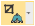
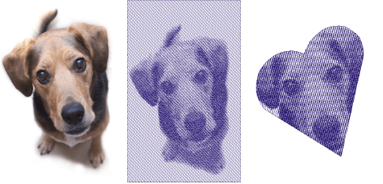
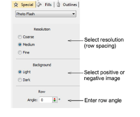
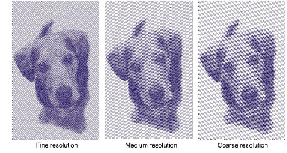
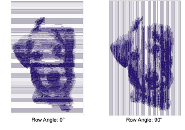
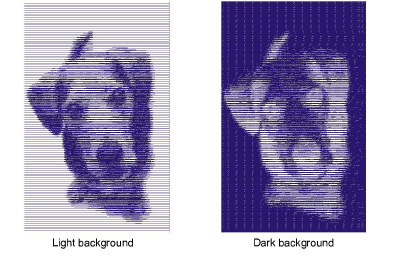
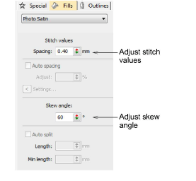
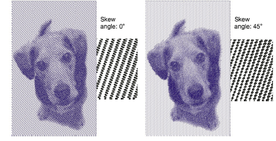

# Auto-digitize with Photo Flash

|            | Use Auto-Digitizing > Photo Flash to create embroidery designs directly from photographs.          |
| ------------------------------------------------------------ | -------------------------------------------------------------------------------------------------- |
|  | Use Mode > Tag as Photo Flash to convert photos to Photo Flash embroidery from CorelDRAW Graphics. |
|              | Use Auto-Digitizing > Crop Bitmap to crop bitmap artwork for use with auto-digitizing.             |

Use Photo Flash to create embroidery from photographs or other images, color or grayscale. Color images are automatically converted to grayscale. Photo Flash designs consist of rows of stitches of varying spacing settings. The effect resembles the output of a line printer.

## To create embroidery with Photo Flash...

1Insert the bitmap image in your design and scale it to the required size.

2Crop the image as desired using the Crop Bitmap tools.

3With the bitmap still selected, click the Photo Flash icon to access object properties.

4In the Resolution panel, select a resolution option – Coarse, Medium, or Fine.

Note: The coarser the resolution the more spacing between rows.

5In the Row panel, enter a new angle as required.

6In the Background panel, select a background option:

| Option | Function                                                               |
| ------ | ---------------------------------------------------------------------- |
| Light  | Applies the maximum row width value to the lightest part of the image. |
| Dark   | Applies the maximum row width to the darkest part of the image.        |

Tip: The option you select usually depends on whether the fabric is light or dark. The Dark option produces a negative of the image.

7Select the Fills tab and adjust the stitch spacing and skew angle as required.

The Skew Angle determines the angle of the stitches.

Tip: Use TrueView™ for a more accurate representation of the stitching.

8Fine-tune Auto Spacing and Auto Split settings as required.

- The Auto Spacing option automatically adjusts stitch spacing according to column width. For columns of varying width, Auto Spacing automatically adjusts the stitch spacing wherever the column changes width.
- Auto Split breaks long Satin stitches into shorter ones. It also distributes needle penetrations in a random pattern so that they do not form a line down the middle of the shape.

9Press Enter or click Apply.

If you have defined a ‘soft crop’ for your bitmap, EmbroideryStudio generates stitches for that area. Otherwise stitches are generated for the entire bitmap.

Note: In CorelDRAW Graphics, the Mode toolbar also includes a Tag as Photo Flash icon which allows you to convert photos to Photo Flash embroidery.

## Related topics...

- [Insert bitmap images](../bitmaps/Insert_bitmap_images)
- [Crop bitmap images](../bitmaps/Crop_bitmap_images)
- [Prepare photos for auto-digitizing](../bitmaps/Prepare_photos_for_auto-digitizing)
- [Satin fixed spacing](../../Digitizing/stitches/Satin_fixed_spacing)
- [Applying satin stitch](../../Digitizing/stitches/Applying_satin_stitch)
- [Split satin stitches](../../Quality/quality/Split_satin_stitches)
