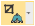
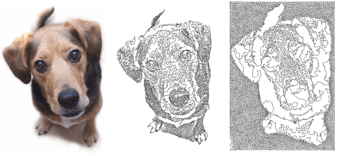
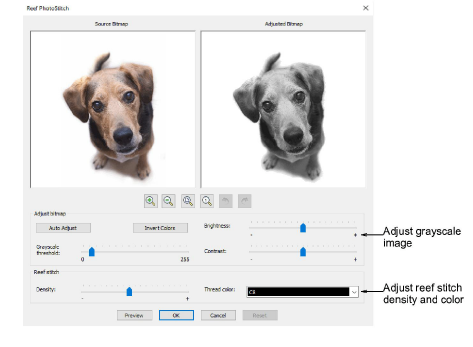
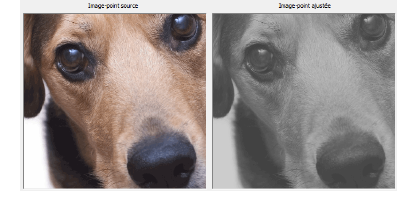
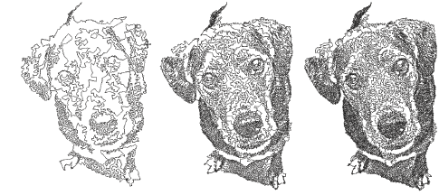
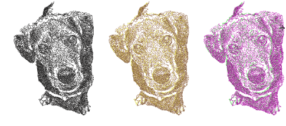
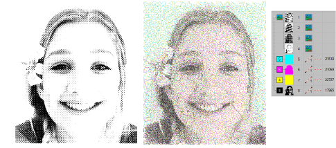

# Auto-digitize with Reef PhotoStitch

|  | Use Auto-Digitizing > Reef PhotoStitch to turn photographs into a single embroidery field resembling a coral reef. |
| ------------------------------------------------------------ | ------------------------------------------------------------------------------------------------------------------ |
|              | Use Auto-Digitizing > Crop Bitmap to crop bitmap artwork for use with auto-digitizing.                             |

Reef PhotoStitch expands on the Photo Flash auto-digitizing method to convert photos into embroidered designs. Automatically fill large areas with open stitching reminiscent of a coral reef. Adjust to the stitch resolution of choice.

## To create embroidery with Reef PhotoStitch...

1. Insert the bitmap image in your design and scale it to the required size.

2. Crop the image as desired using the Crop Bitmap tools.

3. With the image selected, click Reef PhotoStitch.

4. Adjust the grayscale image settings as preferred:

- Click Auto Adjust to allow the software to optimize image settings for automatic digitizing.
- Use Brightness and Contrast settings to further differentiate stitched and unstitched areas.
- Use the Grayscale threshold setting to further filter the number of gray tones in the image.
- Click Invert Colors to create an image negative.
- Click Reset to return the adjusted bitmap to the default grayscale image.

5. Use the zoom buttons to examine the image preview in detail. Alternatively, holding down the Ctrl key, zoom in and out with the mouse wheel.

6. Adjust reef stitch settings as preferred:

- Adjust Density to create more dense or more open stitching, similar to Loop Spacing in stipple stitching. The highest density value may result in thread breaks.
- Select the thread color you wish to apply to the end result.

7. Use Preview to generate temporary stitching without closing the dialog. Move the dialog as necessary in order to preview the result in the design window. Further adjust settings until you obtain the look you want and click OK to confirm.

## Tips for use...

- Use crisp images with well-defined subjects and strong contrasts.
- For denser stitching, try combining different outputs and different colors.

- Posterizing effects may produce good results at lower thresholds. In Corel PHOTO-PAINT, this is available via Image > Transform Posterize.
- Try applying filters such as Stucki, Jarvis and Crosshatch effects.
- In Corel PHOTO-PAINT Stucki and Jarvis are available via Image > Convert to Black and White (1-bit). Adjust intensity as necessary.
- Crosshatch is available via Effects > Art Strokes > Pen & Ink.
- An interesting technique is offered by applying a halftone filter. In the sample below, the image is split into separate CMYK channels and Reef PhotoStitch applied to each one. In Corel PHOTO-PAINT select Image > Convert to CMYK Color and Image > Split Channels To > CMYK.

## Related topics...

- [Insert bitmap images](../bitmaps/Insert_bitmap_images)
- [Crop bitmap images](../bitmaps/Crop_bitmap_images)
- [Prepare photos for auto-digitizing](../bitmaps/Prepare_photos_for_auto-digitizing)
