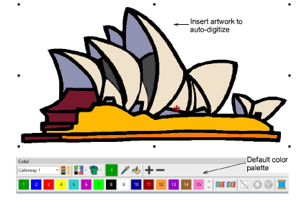
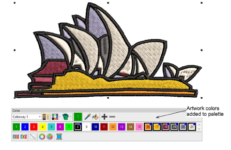
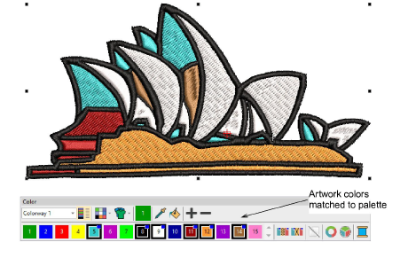

# Auto-digitize ‘instant embroidery’

|            | Use Auto-Digitizing > Color Matching Method to preselect a thread matching method.                             |
| -------------------------------------------------------------------- | -------------------------------------------------------------------------------------------------------------- |
|              | Use Auto-Digitizing > Instant Smart Design to automatically create embroidery from imported artwork instantly. |
|  | Use Auto-Digitizing > Keep Graphic Objects to retain original artwork during conversion.                       |

In essence, creating an embroidery design with the Instant Smart Design tool is simply a matter of selecting the image you want to convert, and clicking the tool. EmbroideryStudio automatically determines colors to treat as fills or outlines, or omit altogether. And it chooses the most suitable stitch types to apply with default settings. This is very useful for stitch estimates. The tool handles both [bitmap](../../glossary/glossary) and [vector](../../glossary/glossary) formats.

## To auto-digitize ‘instant embroidery’...

1. Load and preset the artwork as necessary.

2. Optionally, choose a color matching method.

3. Click Instant Smart Design and study the result.

By default, artwork colors are added to the palette. If you have chosen to match artwork colors, you might obtain a result like this...

4. Edit the result as preferred – e.g. change colors, change stitch types, delete any unwanted background stitching, etc.

- Use the Color-Object List and/or Sequence toolbar to optimize the stitch sequence of your auto-digitized objects.
- Use the Closest Join and/or the Reshape tool to minimize connectors.
- Toggle underlays on/off with the Auto Underlay button.

## Related topics...

- [Loading & presetting artwork](Loading_presetting_artwork)
- [Crop bitmap images](../bitmaps/Crop_bitmap_images)
- [Preparing images for auto-digitizing](../bitmaps/Preparing_images_for_auto-digitizing)
- [Sequencing embroidery objects](../../Modifying/combine/Sequencing_embroidery_objects)
- [Reshaping embroidery objects](../../Modifying/reshape/Reshaping_embroidery_objects)
- [Merge vector & embroidery objects](../../Modifying/reshape/Merge_vector_embroidery_objects)
- [Minimizing connectors](../../Quality/connectors/Minimizing_connectors)
- [Stabilizing with automatic underlay](../../Quality/underlays/Stabilizing_with_automatic_underlay)
