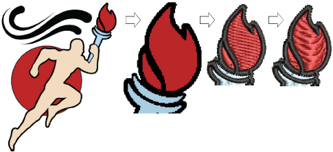

# Auto-digitizing artwork

The quality of auto-digitized designs greatly depends on the type and quality of the original artwork. Generally speaking, [vector](../../glossary/glossary) graphics preserve image quality when resized, whereas [bitmaps](../../glossary/glossary) cause problems of pixelation and image degradation when enlarged or scaled down. In order to make bitmap images more suitable for automatic digitizing, EmbroideryStudio also provides image processing capabilities and links to graphics packages.

## Related topics...

- [Auto-digitize ‘instant embroidery’](Auto-digitize_‘instant_embroidery’)
- [Auto-digitize entire designs](Auto-digitize_entire_designs)
- [Auto-digitize individual shapes](Auto-digitize_individual_shapes)
