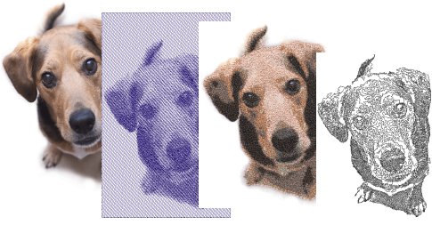

# Auto-digitizing photographs

EmbroideryStudio provides dedicated techniques for auto-digitizing photographs. Both colored and grayscale photos can be used as input.

| Feature                                                        | Overview          |                                                                                                                                                                         |
| -------------------------------------------------------------- | ----------------- | ----------------------------------------------------------------------------------------------------------------------------------------------------------------------- |
|              | Photo Flash       | The Photo Flash feature creates embroidery designs from photographs and other grayscale bitmap images. The effect resembles the output of a line printer.               |
|    | Reef PhotoStitch  | The Reef PhotoStitch feature also creates embroidery designs from photographs and other bitmap images. The features creates open stitching reminiscent of a coral reef. |
|  | Color PhotoStitch | The Color PhotoStitch feature creates embroidery from photographs and other images. It produces variegated stitching using multiple thread colors.                      |

Results depend greatly on the resolution, color depth, and quality of source images. For best results, use crisp images with well-defined subjects and strong contrasts.

In addition a degree of preparation is needed. This may involve preparation using third-party graphics applications such CorelDRAW Graphics. Tools are also available within Wilcom Workspace. [See also Prepare photos for auto-digitizing.](../bitmaps/Prepare_photos_for_auto-digitizing)

## Related topics...

- [Auto-digitize with Photo Flash](Auto-digitize_with_Photo_Flash)
- [Auto-digitize with Reef PhotoStitch](Auto-digitize_with_Reef_PhotoStitch)
- [Auto-digitize with Color PhotoStitch](Auto-digitize_with_Color_PhotoStitch)
