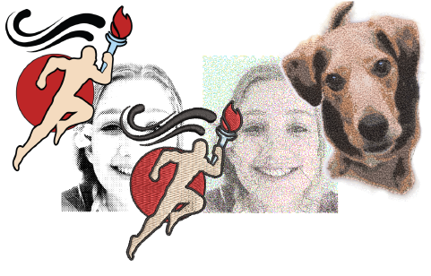

# Automatic Digitizing

[EmbroideryStudio provides a variety of complementary tools and techniques to automatically and semi-automatically digitize suitably prepared artwork and photographs.](../../glossary/glossary)

Auto-digitizing features covered in this section include:

| Feature                                                                    | Overview          |                                                                                                                                                                         |
| -------------------------------------------------------------------------- | ----------------- | ----------------------------------------------------------------------------------------------------------------------------------------------------------------------- |
|  | Convert           | The Convert feature lets you convert vector objects directly to embroidery objects. And vice versa. Entire designs can be converted in either direction.                |
|            | Auto-Digitizing   | The Auto-Digitizing tools provide everything necessary to digitize shapes in graphics automatically without using manual digitizing methods.                            |
|                                  | Smart Design      | The Smart Design feature automatically converts bitmap images to embroidery.                                                                                            |
|                                    | Photo Flash       | The Photo Flash feature creates embroidery designs from photographs and other grayscale bitmap images. The effect resembles the output of a line printer.               |
|                          | Reef PhotoStitch  | The Reef PhotoStitch feature also creates embroidery designs from photographs and other bitmap images. The features creates open stitching reminiscent of a coral reef. |
|                        | Color PhotoStitch | The Color PhotoStitch feature creates embroidery from photographs and other images. It produces variegated stitching using multiple thread colors.                      |

This section describes how to automatically convert graphics to embroidery objects and complete designs using a variety of techniques, as well as how to create embroidery from grayscale images and photographs.

## Related topics...

- [Loading & presetting artwork](Loading_presetting_artwork)
- [Converting designs with CorelDRAW Graphics](Converting_designs_with_CorelDRAW_Graphics)
- [Auto-digitizing artwork](Auto-digitizing_artwork)
- [Auto-digitizing photographs](Auto-digitizing_photographs)
