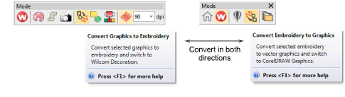

# Convert objects with CorelDRAW Graphics

|                        | Use Mode > Tag Fill as Turning Satin to tag narrow shapes for conversion to turning stitching.                         |
| ------------------------------------------------------------------------------------ | ---------------------------------------------------------------------------------------------------------------------- |
|                  | Use Mode > Match to Embroidery Palette to toggle on/off thread color matching for converted vector objects.            |
|                                    | Use Mode > Tag as Photo Flash to convert photos to Photo Flash embroidery from CorelDRAW Graphics.                     |
|            | Use Mode > Convert Embroidery to Graphics to convert selected embroidery to graphics and switch to CorelDRAW Graphics. |
|  | Use Mode > Convert Graphics to Embroidery to convert selected graphics to embroidery and switch to Wilcom Workspace.   |
|                            | Use Mode > Keep Graphic Objects to retain original artwork during conversion.                                          |

Some EmbroideryStudio product levels include CorelDRAW® Graphics Suite as standard. This lets you convert [vector objects](../../glossary/glossary) directly to [embroidery objects ](../../glossary/glossary)via CorelDRAW Graphics. You can also convert embroidery to vector objects. Individual objects or whole designs can be converted. Bitmaps can also be used.

## To convert graphic and embroidery objects...

- Open a vector or embroidery design, depending on which mode you are working in – CorelDRAW Graphics or Wilcom Workspace.

The Convert function is located on the Mode toolbar. Behavior depends on the operating mode:

- In CorelDRAW Graphics, selected [vector objects](../../glossary/glossary) are converted to embroidery and displayed in Wilcom Workspace.

- In Wilcom Workspace, selected [embroidery objects](../../glossary/glossary#embroidery-objects) are converted to vector objects and displayed in CorelDRAW Graphics.
- If you want to keep a copy of the original vector objects, click the Keep Graphic Objects toggle in CorelDRAW Graphics.
- Use the Match to Embroidery Palette tool to toggle on/off thread color matching.
- When turned on, converted vector objects are assigned the nearest matching thread color in the current color palette.
- When turned off, a new thread color is added to the palette based on the vector color.
- Optionally, activate Tag Fill as Turning Satin. This produces a branched object as shown below.

::: tip
Vectors can also be converted to [appliqué](../../glossary/glossary#applique) as well as to lettering. [See also Creating lettering with CorelDRAW Graphics.](../../Lettering/lettering_create/Creating_lettering_with_CorelDRAW_Graphics)
:::

## Related topics...

- [Working with design files](../../Basics/basics/Working_with_design_files)
- [Creating lettering with CorelDRAW Graphics](../../Lettering/lettering_create/Creating_lettering_with_CorelDRAW_Graphics)
- [Convert vector graphics to appliqué](../../Applied/applique/Convert_vector_graphics_to_appliqué)
