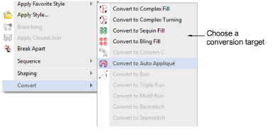
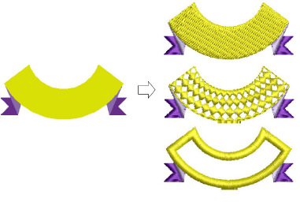
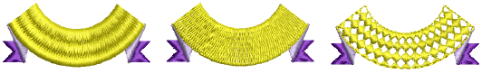
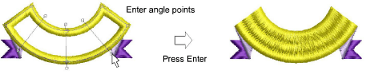

# Convert objects with Wilcom Workspace

You can convert [vector objects](../../glossary/glossary) to embroidery objects by right-clicking a selected object and select Convert > ... from the popup menu.

The resulting object takes the current stitch type, color and [object properties](../../glossary/glossary#object-properties) set for that digitizing method. Vector objects can be converted to [appliqué](../../glossary/glossary#applique). You can also create objects with turning stitches by adding stitch angles directly to vector objects.

You can easily convert objects from [Column A/B](../../glossary/glossary) to [Complex Fill ](../../glossary/glossary)or Complex Turning. This is useful for editing. For example, as curved fill effects can only be used with Complex Fill objects, you can add them to Column A/B shapes by first converting to Complex Fill. Also when [scaling](../../glossary/glossary#scaling) designs, an Column A/B shape may become too big for Turning Satin. By converting to Complex Fill or Complex Turning, you can apply fixed or turning Tatami or some other fill stitch type.

You can change an [Appliqué](../../glossary/glossary) or vector object to a complex fill object in the same way. You can also convert Complex Fill to Complex Turning. If you convert to Complex Turning, you are prompted to enter more than one stitch angle line and press Enter.

::: info Note
If a current stitch type is not applicable to the target object – e.g. Contour stitch – Satin will be substituted. If the underlay type is not applicable – e.g. Center Run – Zigzag will be used.
:::

## Related topics...

- [Adjusting stitch angles](../../Quality/quality/Adjusting_stitch_angles)
- [Convert embroidery objects to appliqué](../../Applied/applique/Convert_embroidery_objects_to_appliqué)
