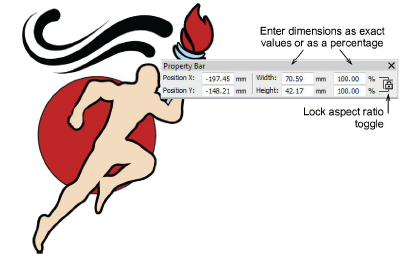
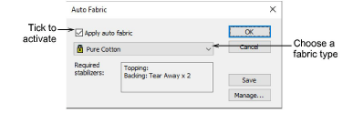
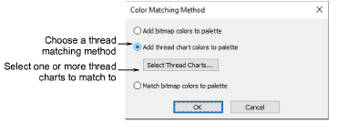

# Loading & presetting artwork

|  | Use Auto-Digitizing > Color Matching Method to preselect a thread matching method.     |
| ------------------------------------------------ | -------------------------------------------------------------------------------------- |
|            | Use Auto-Digitizing > Crop Bitmap to crop bitmap artwork for use with auto-digitizing. |

Artwork can be inserted, pasted or scanned into EmbroideryStudio for use as digitizing [backdrops](../../glossary/glossary). For both manual and automatic digitizing purposes, ‘clean’ images, sometimes referred to as ‘cartoons’, work best. The auto-digitizing tools handle both [bitmap](../../glossary/glossary#bitmap) and [vector](../../glossary/glossary) formats.

## To load & preset artwork for auto-digitizing...

1. Import the artwork. Whether you’re working with [bitmap](../../glossary/glossary#bitmap) or [vector](../../glossary/glossary) graphics, you need to prepare them first:

- Scan or insert a [bitmap](../../glossary/glossary#bitmap) image. If you are using a bitmap image as input, it will need to be image-processed before conversion.
- Insert or create a [vector](../../glossary/glossary) graphic. If you are using a vector graphic as input, you can remove overlapping objects by ‘merging’ them. This eliminates overlapping stitching when vector objects are converted.

2. Whether you’re working with bitmap or vector graphics as input, you may want to prepare them first:

- If you are using a bitmap image, it can be image-processed before conversion.
- If you are using a vector graphic, you can remove overlapping objects by ‘merging’ them. This eliminates overlapping stitching when vector objects are converted.

3. Size the image to the preferred dimensions for your target article.

4. Optionally, select Design > Auto Fabric to apply preferred fabric settings.

5. Crop the image as desired using the Crop Bitmap tools.

6. Optionally, click Color Matching Method and decide how you want to handle color matching.

You have three options:

- Add bitmap colors directly to the design palette (default).
- Choose a chart and match bitmap colors to actual threads. Click the Select Thread Charts button to access thread charts.
- Or, match bitmap colors to the nearest colors in the design palette.

::: tip
Various techniques are available for changing design colors from the Design Colors toolbar.
:::

## Related topics...

- [Loading bitmap artwork](../bitmaps/Loading_bitmap_artwork)
- [Loading vector artwork](../vectors/Loading_vector_artwork)
- [Preparing artwork for digitizing](../bitmaps/Preparing_artwork_for_digitizing)
- [Preparing images for auto-digitizing](../bitmaps/Preparing_images_for_auto-digitizing)
- [Add & match image colors](../bitmaps/Add_match_image_colors)
- [Working with fabrics](../../Digitizing/properties/Working_with_fabrics)
- [Choosing threads](../../Basics/threads/Choosing_threads)
