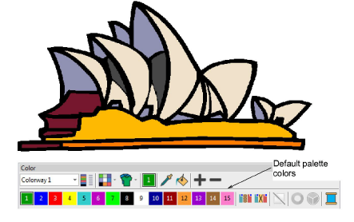
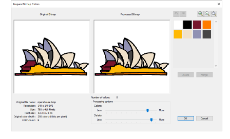
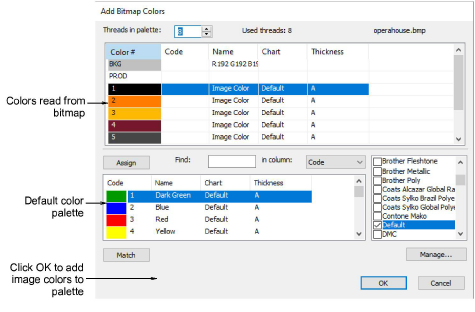
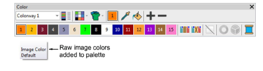
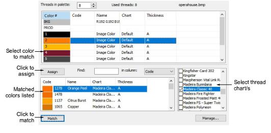
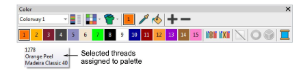

# Add & match image colors

You can manually match colors from an inserted [bitmap](../../glossary/glossary) or vector graphic to thread colors in selected chart/s. Alternatively, simply add raw image colors to the palette for later matching.

## To add and match image colors...

- Insert a bitmap image for use as a digitizing backdrop.

- Select Graphics > Add Bitmap Colors. The Prepare Bitmap Colors dialog opens by default.

- Reduce design colors to the minimum necessary before adding to the color palette. Click OK to confirm.
- Selected colors are displayed in the Add Bitmap Colors dialog.

- To add the image colors directly to current colorway, simply click OK. The raw image (RGB) colors are transferred. These can be used as is and thread-matched at any time.

- Alternatively, to make thread selections straight away, select the thread chart/s to use from panel.
- Select an image color and click Match. The system searches for the closest match in the selected chart/s and displays them in the thread color list.
- To assign the thread color, double-click or click Assign.
- Repeat until all colors you intend to use in the design have been matched.

- Click OK. The selected threads are assigned to the current colorway.

Note: The maximum number of new thread colors which can be added to the color palette from a [bitmap](../../glossary/glossary) is 128.

## Related topics...

- [Preparing images for auto-digitizing](Preparing_images_for_auto-digitizing)
- [Auto-digitize individual shapes](../automatic/Auto-digitize_individual_shapes)
- [Insert bitmap images](Insert_bitmap_images)
