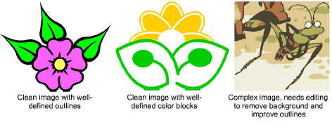
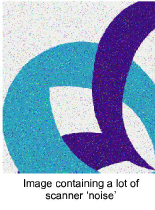
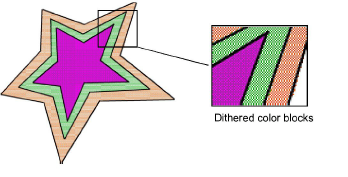
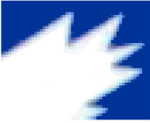

# Choosing suitable artwork

For both manual and automatic embroidery digitizing purposes, ‘clean’ images, sometimes referred to as ‘cartoons’, work best. Such images have a limited number of solid colors which in turn have well-defined outlines. Ideally, they are:

- Well defined, where each shape is made up of pixels of the same color.
- Clearly ‘blocked’, where each shape is a stitchable size, at least 1 sq mm.
- Saved at a color depth of at least 256 colors (8 bit), or preferably millions of colors (16 bit).

Best results are produced with images of the type found in clipart libraries or created from scratch in CorelDRAW®. EmbroideryStudio can work with images from other sources but they require some preparation. This is because most commonly available images are not made up of solid colors. Scanners introduce noise, while graphics packages perform ‘dithering’ and ‘anti-aliasing’ to improve image print quality.

## Photographic images

Embroidery digitizing works least effectively with photographic images which may contain many dithered colors and complex forms. With photographs, however, you can pick out shapes that you want to embroider, leaving out unnecessary detail. For best results, use sharp images with well-defined subjects and contrasting shades.

You can also use Photo Flash to create embroidery from photographs or other images, color or grayscale. Photo Flash designs consist of rows of stitches of varying spacing settings. The effect resembles the output of a line printer. [See also Auto-digitize with Photo Flash.](../automatic/Auto-digitize_with_Photo_Flash)

An extension of Photo Flash, you can also use Color PhotoStitch to create embroidery from photos. While Photo Flash designs consist of rows of single-color satin stitching, Color PhotoStitch produces variegated stitching using multiple thread colors. The overall effect is like multi-colored stippling. [See also Auto-digitize with Color PhotoStitch.](../automatic/Auto-digitize_with_Color_PhotoStitch)

## Scanned images

Images scanned from hardcopy drawings or existing embroidery typically contain a lot of introduced ‘noise’. While they can be used as input to embroidery digitizing, once again, best results are achieved with relatively clean images consisting of solid color blocks. Typically, logos and simple drawings scanned from business cards, letterheads, books, magazines, cards all fall into this category.

Noisy images typically need to be prepared by reducing the color count and sharpening the outlines. [See also Preparing artwork for scanning.](Preparing_artwork_for_scanning)

## Dithered images

Dithering is a software technique which combines existing colors in a checkerboard arrangement of pixels. It is typically used to simulate colors that are missing from an image palette.

Like noisy images, dithered images need to be color-reduced before use. Be aware, however, that while EmbroideryStudio can process dithered colors within a defined outline, it does not work so well with non-outlined images.

## Anti-aliased images

Anti-aliasing is a software technique similar to dithering which is used to soften hard outlines where color blocks intersect. It produces smoother outlines by ‘blurring’ the pixels where colors join.

Where anti-aliasing is deliberately used to blur outlines, these need to be ‘sharpened’ before use with automatic digitizing.

## Color depth

When loaded into EmbroideryStudio, images are automatically reduced to 256 colors or less. The main reason is to provide acceptable performance for automatic digitizing.

256 colors sounds a lot for embroidery needs and, in practice, a 256 color image may look quite similar to a 24-bit RGB image. The appearance and quality differences can only be observed by zooming in. The 256-image will be dithered to improve its appearance at a distance. However, this feature is also responsible for single color pixels and small areas, which effectively create image noise. This in turn can affect the quality of automatically generated embroidery.

## Guidelines

Bear in mind the following key points when selecting artwork for auto-digitizing:

- Use 300 DPI high-resolution images, NOT low-res 96 DPI.
- Do not use anti-aliasing.
- Do use PNG format, not JPG.
- Do use transparent backgrounds.
- If the image does not conform to these settings, return to the original vector artwork and generate a bitmap that includes them.
