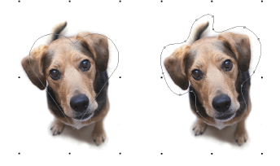

# Crop bitmap images

|        | Use Auto-Digitizing > Crop Bitmap to crop bitmap artwork for use with auto-digitizing.                                |
| -------------------------------------------- | --------------------------------------------------------------------------------------------------------------------- |
|      | Click Auto-Digitizing > Remove Crop to remove any crop areas applying to selected artwork.                            |
|  | Click Auto-Digitizing > Finalize Crop to make the cropping permanent. Once finalized, the cropping cannot be removed. |

Before using [bitmap](../../glossary/glossary#bitmap) images for design purposes, crop them to remove unnecessary detail and save processing time. EmbroideryStudio allows you to ‘soft crop’ images which means that you can redefine or remove the cropping area at any stage.

## To crop a bitmap image...

- Scan or import the image to use.
- Select the image and choose a cropping tool from the Crop Bitmap droplist. The same options are available under the Graphic menu.

- Click and drag the selected shape around the area to be cropped. Alternatively, use the Any Shape method to digitize a cropping shape.

- Reshape or transform the cropping shape with the Reshape tool.

- Click Select Object or press Esc to close.
- To remove a cropping area, select all reshape nodes and press Delete.
- Use the Graphics > Finalize Crop command to crop an image to its new visible extents. When you create a cropped area, it is considered ‘temporary’ and can be reshaped at will. By using the Finalize Crop command, you make the crop permanent. The only way to go back is via the Undo command or by reinserting the original bitmap.

## Related topics...

- [Insert bitmap images](Insert_bitmap_images)
- [Reshaping embroidery objects](../../Modifying/reshape/Reshaping_embroidery_objects)
