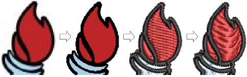

# Digitizing with Bitmaps

EmbroideryStudio supports the automatic and semi-automatic digitizing of both [bitmap](../../glossary/glossary) images and [vector graphics](../../glossary/glossary). The quality of the resulting designs greatly depends on the type and quality of the original [artwork](../../glossary/glossary). Generally speaking, vector graphics preserve the picture quality when resized, whereas bitmap images cause problems of [pixelation](../../glossary/glossary) and image degradation when enlarged or scaled down. You can insert or paste third-party vector graphics such as clipart for use in embroidery designs. Alternatively, insert, paste or scan [bitmap](../../glossary/glossary) artwork for use as digitizing templates or ‘[backdrops](../../glossary/glossary)’. In order to make bitmap images more suitable for automatic digitizing, EmbroideryStudio provides image processing capabilities.

Note: CorelDRAW Graphics includes the latest CorelDRAW® Graphics Suite drawing tools. These offer many sophisticated techniques for drafting outlines and shapes on screen. [Vector graphics](../../glossary/glossary) so created can be directly converted to embroidery objects or even entire designs. For a full description of the CorelDRAW® tools, refer to the electronic User Guide available via the MS Windows® Start > Programs group. Alternatively, use the online help available from the Help menu.

## Related topics...

- [Loading bitmap artwork](Loading_bitmap_artwork)
- [Preparing artwork for digitizing](Preparing_artwork_for_digitizing)
- [Preparing images for auto-digitizing](Preparing_images_for_auto-digitizing)
- [Preparing artwork for continuous embroidery](Preparing_artwork_for_continuous_embroidery)
