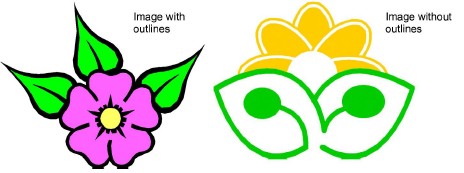
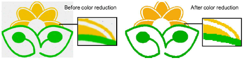
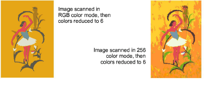
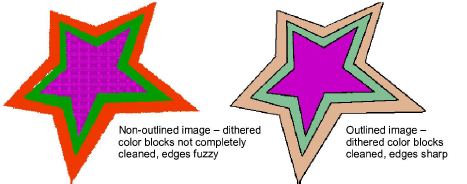
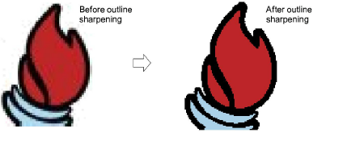

# Image preparation techniques

Before converting [artwork](../../glossary/glossary) to [vector graphics](../../glossary/glossary), you frequently need to clean it up. To work effectively, the Convert function requires solid color images as input. You can improve artwork with the [bitmap](../../glossary/glossary) editing tools.

Note: For a full description of the editing tools in CorelDRAW Graphics, refer to the electronic User Guide available via the MS Windows® Start > Programs group. Alternatively, use the online help available from the Help menu.

## Outlined vs non-outlined images

Before preparing your image you need to know what type you are using. For the purposes of automatic digitizing, there are two categories – outlined and non-outlined. Outlined images ideally have a solid black outline around each colored area. Non-outlined images ideally consist of solid areas of color. Outlined and non-outlined images require different methods of preparation.

## Image cleanup

In practice, cleaning up scanned images may involve any one or a combination of the following techniques:

- Reducing the number of colors
- Adding or emphasizing outlines
- Removing noise, dithering or anti-aliasing
- Eliminating unnecessary detail
- Cropping sections
- Eliminating backgrounds.

## Color reduction

Sometimes an image looks clean but extra colors have been introduced during scanning or processing. Color reduction means reducing the actual number of image colors in order to eliminate unnecessary detail and reduce each block to a single color. Color reduction also cleans the image, removing any noise and anti-aliasing present. This in turn helps minimize the number of trims and color changes required in the resulting embroidery design. Color reduction should only be applied if the loss of detail does not affect the image shapes. Before reduction, the colored areas in the image below include many colors. After reduction, each area is reduced to a single color. The detail is preserved.

If you are scanning images, make sure you scan them correctly for best results. [See also Preparing artwork for scanning.](Preparing_artwork_for_scanning)

Be aware that some techniques are better for removing noise and anti-aliasing but not so good for processing dithering in non-outlined images. [See also Choosing suitable artwork.](Choosing_suitable_artwork)

## Outline sharpening

Outline sharpening means emphasizing outlines bordering distinct color blocks. These may have been indistinct in the original or made so by the scanning process. Outline sharpening is important for vectorizing because it makes it easier for EmbroideryStudio to identify areas for conversion to embroidery.

[CorelDRAW Graphics bitmap editing tools prior to vector tracing. Refer to the electronic User Guide available via the MS Windows® ](../../glossary/glossary) Start > Programs Help

## Noise filtering

Noise filtering means restoring the solid color blocks of the original [artwork](../../glossary/glossary) in scanned images. This is achieved by merging different shades into one solid color. Noise filtering is important for vectorization because it makes it easier for EmbroideryStudio to identify solid color blocks to become embroidery objects in the resulting design. It also cleans up blurred or mottled areas of color.

## Image preparation summary

| Action                   | Outlined image                                                                                                                                                                                                                                                                                                | Non-outlined image                                                                                                                                                        | Photograph                                                                    |
| ------------------------ | ------------------------------------------------------------------------------------------------------------------------------------------------------------------------------------------------------------------------------------------------------------------------------------------------------------- | ------------------------------------------------------------------------------------------------------------------------------------------------------------------------- | ----------------------------------------------------------------------------- |
| Scan artwork             | Scan in RGB mode Use sharpening                                                                                                                                                                                                                                                                               | Scan in RGB mode No sharpening                                                                                                                                            | Scan in RGB mode                                                              |
| Scan line drawing        | Scan in two color mode                                                                                                                                                                                                                                                                                        | \-                                                                                                                                                                        | \-                                                                            |
| Touch up graphics        | Crop Add or edit outlines Edit colors Remove noise                                                                                                                                                                                                                                                            | Crop Edit image shapes Edit colors Remove noise                                                                                                                           | Crop Convert to grayscale Remove background Lighten or darken Adjust contrast |
| Adjust bitmap            | Adjust lightness or darkness of outlines manually.                                                                                                                                                                                                                                                            | Adjust lightness or darkness of outlines manually.                                                                                                                        | Adjust lightness or darkness of outlines manually.                            |
| Prepare bitmaps          | Adjust lightness or darkness of outlines. Automatically: blend each outlined block into a single color remove anti-aliasing, noise and dithering sharpen outlines.                                                                                                                                            | Reduce colors to a specified number. Automatically: reduce each block to a single color remove anti-aliasing, noise and dithering remove colors less than specified area. | \-                                                                            |
| Vectorize bitmaps        | CorelDRAW Graphics provides the latest CorelDRAW® drawing tools. These offer many sophisticated techniques for drafting outlines and shapes on screen. Refer to the electronic User Guide available via the Windows Start > Programs group. Alternatively, use the online help available from the Help menu. |                                                                                                                                                                           |                                                                               |
| Convert vectors directly | EmbroideryStudio provides techniques for both converting vectors directly to embroidery as well as manual digitizing of prepared artwork. [See Digitizing Shapes for details.](../../Digitizing/input/Digitizing_Shapes)                                                                                      |                                                                                                                                                                           |                                                                               |
| Digitize automatically   | Manual Auto-Digitizing Instant Smart Design Smart Design                                                                                                                                                                                                                                                      | Manual Auto-Digitizing Instant Smart Design Smart Design                                                                                                                  | Photo Flash Color PhotoStitch                                                 |
