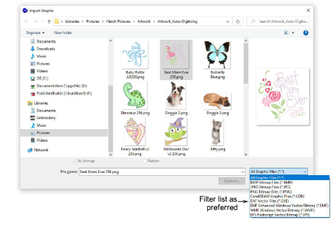
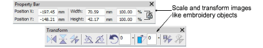

# Insert bitmap images

|  | Use Standard > Import Graphic to import artwork into current design as a backdrop for manual or automatic digitizing. |
| ---------------------------------------------- | --------------------------------------------------------------------------------------------------------------------- |
|      | Use View > Show Bitmaps to toggle bitmap images on or off. Right-click for settings.                                  |

[Bitmap](../../glossary/glossary) images of various formats can be imported or pasted into EmbroideryStudio for use as digitizing backdrops.

Tip: If you are editing images in a third-party graphics application, you can copy and paste into EmbroideryStudio via the Windows clipboard.

## To import a bitmap image...

1Click the Import Graphic icon or select File > Import Graphic.

2Navigate to the graphics folder. The dialog defaults to ‘All graphic files’ which displays all supported file types, bitmap and vector.

3Filter the Files of Type list as required – e.g. ‘BMP’.

Note: While ‘All graphic files’ includes both vector and bitmap formats, for native CDR and other vector file types, use the CorelDRAW® Graphics Suite import function.

4Select a file and click Open.

5Scale and transform the image on-screen or via the Property and Transform toolbars.

Tip: Use Auto Trace To Vectors to create [vector](../../glossary/glossary) outlines from [bitmap](../../glossary/glossary) images. You can then convert these to embroidery objects using a variety of input methods. Auto Trace To Vectors can find holes in shapes – both inside and outside boundaries are detected.

## Related topics...

- [Operating modes](../../Basics/basics/Operating_modes)
- [Auto-tracing bitmap artwork](../vectors/Auto-tracing_bitmap_artwork)
- [Supported machine types](../../Management/formats/Supported_machine_types)
