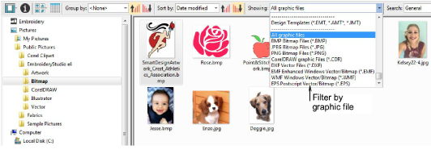

# Open graphic files directly

|      | Click Mode > Design Library to open the Design Library window from which to search and manage designs and job orders. |
| -------------------------------------------------- | --------------------------------------------------------------------------------------------------------------------- |
|  | Use Manage Designs > New From Selected to create new designs based on designs selected in Design Library.             |

Artwork can be opened in EmbroideryStudio in both vector and bitmap (raster) formats via Design Library. Samples of both file types are installed with EmbroideryStudio in the Pictures library as shown below.

The New from Selected command can also be used to open graphics files, including Corel CDR. With CDR, a new file is opened in EmbroideryStudio before switching to CorelDRAW Graphics.

## Related topics...

- [Combining objects & designs](../../Modifying/combine/Combining_objects_designs)
- [Opening designs from Design Library](../../Management/manage_designs/Opening_designs_from_Design_Library)
- [Working with templates](../../Digitizing/properties/Working_with_templates)
