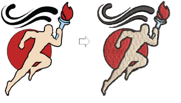
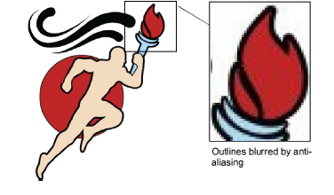
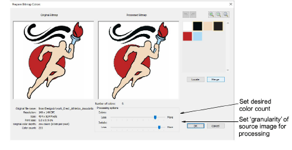
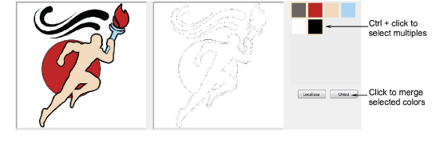
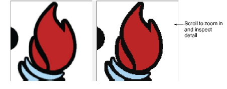
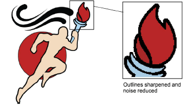

# Prepare bitmaps for auto-digitizing

|  | Use Auto-Digitizing > Prepare Bitmap Colors to reduce the number of colors and remove image ‘noise’ in non-outlined images. |
| ------------------------------------------------------ | --------------------------------------------------------------------------------------------------------------------------- |

The Auto-Digitizing tools provide everything necessary to automatically digitize shapes in electronic [artwork](../../glossary/glossary#artwork) without using manual input methods. Even if your artwork looks ready to stitch when inserted into the software, however, it will need to be image-processed before conversion.

Use the Prepare Bitmap Colors tool to prepare images for automatic digitizing. This function automatically flattens colors, sharpens outlines, and reduces ‘noise’. Areas enclosed by a black outline are reduced to a single color. This makes it easier for the software to recognize distinct areas in the artwork. These areas then become the embroidery objects of the finished design.

## To prepare bitmaps for auto-digitizing...

- Scan or import the image to use. Depending on the quality of the scanned image, you may need to touch it up manually before processing in EmbroideryStudio. You would normally do this in order to eliminate backgrounds, flood-fill solid areas with color, add or reinforce outlines, or close gaps.
- Depending on the source, you may find dithering, anti-aliasing, or other sources of ‘noise’ in the image. If it contains outlines, these will generally be blurred by anti-aliasing.

- Select the image and click the Prepare Bitmap Colors icon. The image appears in both ‘before’ and ‘after’ preview panels. Note the number of colors in the original. The software automatically detects the main color blocks and reduces colors accordingly.

- If there appear to be too few colors to provide the detail you want, use Processing options to increase the color count.
- Manually locate and merge like-colors as necessary:
- Holding the Ctrl key, click like-colors to select.
- Click and hold Locate to preview.
- Click Merge to merge like-colors into a single color.

- Use the scroll button on your mouse to zoom in and inspect details.

- Adjust the Details slider to control number of details and resultant objects.

While this setting doesn’t affect the image, it affects the embroidery result by filtering out smaller areas of color. ‘More’ generally results in greater detail and number of objects. ‘Fewer’ generally results in fewer details and objects. It is useful for ‘noisy’ images with lots of small areas. It works well with JPG files which are inherently more noisy.

- Click OK to process the image. Image colors should be reduced as per the preview. The artwork can now be auto-digitized.

## Related topics...

- [Graphics and multi-decoration file formats](../../Management/formats/Graphics_and_multi-decoration_file_formats)
- [Scan images](Scan_images)
- [Insert bitmap images](Insert_bitmap_images)
- [Crop bitmap images](Crop_bitmap_images)
- [Touch up bitmaps](Touch_up_bitmaps)
- [View graphical components](../../Basics/view/View_graphical_components)
- [Auto-digitizing photographs](../automatic/Auto-digitizing_photographs)
