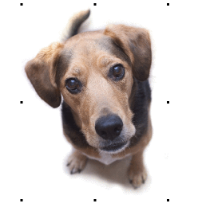
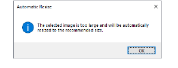
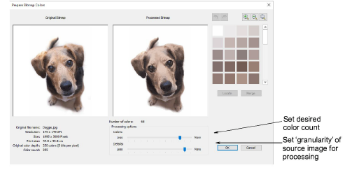
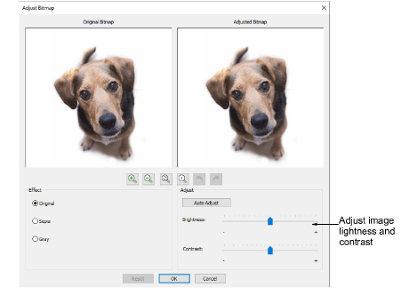
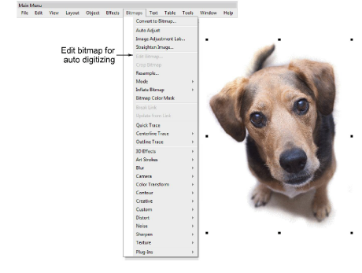

# Prepare photos for auto-digitizing

|  | Use Auto-Digitizing > Prepare Bitmap Colors to reduce the number of colors and remove image ‘noise’ in non-outlined images.          |
| ---------------------------------------------------------------- | ------------------------------------------------------------------------------------------------------------------------------------ |
|                      | Use Auto-Digitizing > Adjust Bitmap to adjust image lightness and contrast in preparation for auto-digitizing.                       |
|                  | Use Auto-Digitizing > Crop Bitmap to crop bitmap artwork for use with auto-digitizing.                                               |
|            | Use Mode > CorelDRAW Graphics to import, edit or create vector artwork as a backdrop for embroidery digitizing, manual or automatic. |

A degree of preparation is needed for any of the photographic auto-digitizing techniques. For best results, use crisp images with well-defined subjects and strong contrasts.

## To prepare photos for auto-digitizing...

- Scan or insert the photo you want to use. For best stitching results, images are better imported via the CorelDRAW Graphics than Wilcom Workspace.

- If you cannot see the image, turn on Show Bitmaps.
- Optionally, crop the image.
- Size the photo for its intended purpose. Optimal size is 150mm x 150mm or about 6" x 6". 210mm is about the limit for optimal results. You may be prompted to resize when you run one of the PhotoStitch features.

- If your graphics application supports it, try re-sampling the image while resizing.
- Optionally, use the Prepare Bitmap Colors tool to reduce the number of colors and remove image ‘noise’.

- Optionally, use Adjust Bitmap to adjust basic lightness and contrast.

- First, try clicking Auto Adjust to allow the software to optimize image settings. This works well most of the time. Use Brightness and Contrast settings to sharpen the image further.
- Optionally, click Reset to return the image to default settings.
- Choose between image variations:

| Option | Function                                                                                                                                                                             |
| ------ | ------------------------------------------------------------------------------------------------------------------------------------------------------------------------------------ |
| Sepia  | In photographic terms, ‘sepia’ refers to the dark-brown color of old-fashioned prints. Originally the process involved adding a pigment made from cuttlefish ink during development. |
| Gray   | Grayscale images are ones composed exclusively of shades of gray, varying from black at the weakest intensity to white at the strongest.                                             |

- Optionally, switch to Graphics Mode for alternative pre-processing.

- For the full range of image adjustment techniques, use a dedicated graphics program like Corel PHOTO-PAINT®. If installed, the Edit Bitmap option is available.

## Related topics...

- [Scan images](Scan_images)
- [Insert bitmap images](Insert_bitmap_images)
- [Crop bitmap images](Crop_bitmap_images)
- [Touch up bitmaps](Touch_up_bitmaps)
- [View graphical components](../../Basics/view/View_graphical_components)
- [Auto-digitizing photographs](../automatic/Auto-digitizing_photographs)
