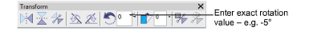

# Preparing artwork for continuous embroidery

Many customers make traditional garments such as sarees which employ continuous and sometimes overlapping designs. It is important that artwork used for continuous embroidery is properly sized and orientated. When doing continuous designs on multihead systems, horizontal distance will generally be a function of the gap between machine heads – e.g. 135 mm.

There are two main sources of artwork for continuous embroidery:

- Enlargement drawings. These are typically used with a digitizing tablet. See the Schiffli Supplement for details.
- Scanned images or graphics files from third-party software. These are used for on-screen digitizing.

The same considerations apply for both types of artwork. However, while with enlargement drawings you adjust drawing scale, with electronic artwork, you adjust on-screen image size and rotation. Generally electronic artwork will be prepared to exact dimensions. To check a design repeat, you need to measure the distance between two repeat points. You will need to choose clearly identifiable points on the design which are easy to identify.

## To adjust an image to repeat...

- Scan or insert your artwork as you would a normal digitizing backdrop. If you have prepared your artwork in CorelDRAW Graphics, switch to Wilcom Workspace.
- Select View > Measure. Click the first (left) repeat reference point, then place the cursor over the second point.

- Check the X and Y values and the angle. If the angle is not zero the image may need to be rotated. You can decide the acceptable tolerance. Small errors are usually acceptable. Usually 0.3mm in real size is the smallest error the human eye can discern.

- If you need to rotate it, select the image and enter the exact rotation setting in the Transform toolbar.

::: warning Caution
Rotation of bitmap images can reduce definition. For better quality, go back to the source application and adjust artwork there. Or, in the case of scanned artwork, adjust it on the scanner and re-scan.
:::

- Once rotation is fixed, measure the two points again and compare the X value with the Design Repeat value. Again you need to decide what tolerance is acceptable. First you need to calculate the necessary scale factor, which is:

Scale Factor = (Measured Repeat (X) ÷ Design Repeat) × 100%

If the image needs to be enlarged by 10%, you will get 110% or a similar value. If it needs to be reduced by 5%, you will get 95% or similar.

- If necessary, adjust dimensions by a percentage in Property Bar.

::: tip
The Show Repeats function displays repeating designs, including sequins, in both TrueView and stitch view. You can view a design, even while digitizing, with any number of repeats.
:::

## Related topics...

- [Viewing design repeats](../../Basics/view/Viewing_design_repeats)
