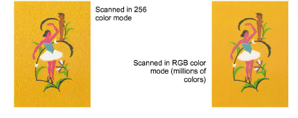

# Preparing artwork for scanning

If you have existing [artwork](../../glossary/glossary), you can scan it in CorelDRAW Graphics with a [WIA](../../glossary/glossary)\-compatible (Windows Image Acquisition) scanner using the scanning function. It is important to scan your artwork properly if you intend to use one of the automatic digitizing techniques – the scanned image quality will affect the quality of the final embroidered design.

With embroidery design, less is more. You don’t need every detail in an image to create a design. You use the ‘structure’ of the image rather than the fine details of texture and color. To simplify artwork, you can cover it with tracing paper and draw only the essential shapes and lines which will be filled with stitches. When scanning, take away the original artwork and put white paper behind the tracing paper. Shiny surfaces, such as glossy photographs, may not scan well. Cover them with tracing paper. If the artwork has very light colors, highlight outlines with a fine black felt-tip pen.

Note: For a full description of how to scan images into CorelDRAW® Graphics Suite, refer to the electronic User Guide available via the MS Windows® Start > Programs group. Alternatively, use the online help available from the Help menu.

## Scanning resolution

Most scanners require you to enter scanning resolution information. Resolution determines the number of dots per inch (DPI) used to create an image. Generally speaking, the smaller the source image and/or more detail it contains, the higher the resolution needs to be. Use the following table as a guide.

| Type of artwork              | Scanning resolution |
| ---------------------------- | ------------------- |
| Business cards, letter heads | 150 - 300 dpi       |
| Hand sketches                | 150 - 300 dpi       |
| Photos and images            | 150 - 300 dpi       |
| Commercial art, line drawing | 72 - 150 dpi        |

## Color mode

Most scanners also require you to enter color mode information. First decide whether your image is line art (black and white drawing), sketch, color picture, or black and white or color photograph, then choose an appropriate mode. Black and white mode produces the smallest files. Color photograph and grayscale modes generate 256 color images and produce similar sized files. ‘RGB’, ‘True Color’ or ‘millions of colors’ modes generate 16.7 million colors and produce the biggest files. Use the table below to decide which mode is suitable for use with your image.

| Source image                                                                 | Example                                                    | Description                           | Recommended color mode \*                  | No. of colors in scanned image |
| ---------------------------------------------------------------------------- | ---------------------------------------------------------- | ------------------------------------- | ------------------------------------------ | ------------------------------ |
| Line art                                                                     |                          | Two colors – usually black and white  | Black/white drawing Line art               | 2 2                            |
| Drawing/sketch                                                               |                          | Sketch or drawing with shades of gray | Grayscale Line art                         | 256 2                          |
| Black & white photograph                                                     |                        | Shades of gray                        | Black/white photo Grayscale                | 256 256                        |
| Color photograph                                                             |  | Many colors                           | Color RGB Color photo                      | 16 million 256                 |
| Color picture                                                                |              | Two colors or more                    | Color RGB Millions of colors Color drawing | 16 million 16 million 2 - 256  |
| \* Different scanning software uses different terms for the equivalent mode. |                                                            |                                       |                                            |                                |

## Scanning tips

- Do not scan line art images in grayscale mode – grayscale scanning produces fuzzy edges.
- Scan color images in RGB mode (millions of colors) rather than 256 color mode. The color count can be reduced once the image is loaded into the software. EmbroideryStudio can use the extra information to produce a better image than one scanned at 256 colors.

- Do not scan color images in CMYK (Cyan, Magenta, Yellow, and Black) mode as this is only used for images that will be printed – colors may be different to RGB colors.
- If the image needs to be rotated, do so while scanning. Rotating afterwards may distort the image.

## Sharpening

Some scanning software lets you apply what is called ‘sharpening’ as you scan. Sharpening compensates for the slight blurring in a scanned image by looking for any differences between colors. Sharpening accentuates these differences which makes the image edges more defined. It does not increase image details but makes them more obvious. In general, use sharpening with well-defined outlines. Don’t use it with non-outlined images.

