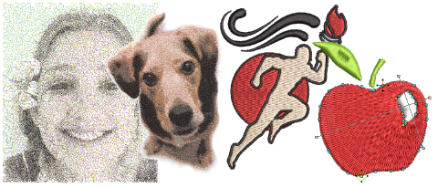

# Preparing images for auto-digitizing

The Auto-Digitizing tools provide everything necessary to automatically digitize electronic [artwork](../../glossary/glossary#artwork) and photographs. Results depend greatly on the resolution, color depth, and quality of source images. For best results, use crisp images with well-defined subjects and strong contrasts. In addition a degree of preparation is needed. This may involve preparation using third-party graphics applications such CorelDRAW Graphics. Tools are also available within Wilcom Workspace.

## Related topics...

- [Prepare bitmaps for auto-digitizing](Prepare_bitmaps_for_auto-digitizing)
- [Prepare photos for auto-digitizing](Prepare_photos_for_auto-digitizing)
