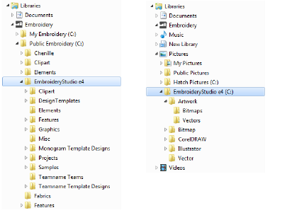

# Sample designs & artwork

EmbroideryStudio contains hundreds of ready-to-stitch designs, including attractive ornaments, samples and digitizing [backdrops](../../glossary/glossary). Design files (EMB files) and images (BMP, JPG, and WMF files) can be found in your Embroidery and Picture libraries.

The most valuable thing you can do when starting out is to spend some time exploring these designs and getting to know what’s available. EmbroideryStudio includes its own Design Library design management application to view and manage your embroidery designs. Alternatively, explore design folders using File Explorer. [See also Design Management.](../../Management/manage_designs/Design_Management)

Note: CorelDRAW® needs to be registered before it can be used by EmbroideryStudio. Registration gives you access to the latest CorelDRAW® updates. It also provides CorelDRAW® Standard Membership which gives you access to content – clipart, fonts, stock photos, templates – via Corel CONNECT.

Caution: Included artwork (clipart) and embroidery designs can only be used for personal use – i.e. they cannot be commercially sold in any form. Changing the medium – i.e. clipart to embroidery or embroidery to clipart – does not remove copyright protection.
