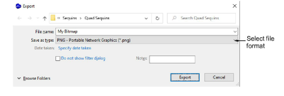

# Save artwork

All images placed in the design window, whether by scanning, pasting or inserting from hard disk, are saved together with the embroidery design in the EMB file. After editing in EmbroideryStudio or third-party graphics application, you may want to save the image out as a separate file.

## To save artwork...

1. Scan or load the image you want to use.

2. Still in CorelDRAW Graphics mode, select the image.

3. Select File > Export. The Export dialog opens.

4. Choose a suitable file format from the droplist – e.g. BMP or PNG.

5. Select an export folder, then select a format from the Save as type droplist.

6. Enter a file name and click Export.

::: info Note
This file is not referenced by the EMB file. Any further changes to it are not reflected in the embedded image.
:::

## Related topics...

- [Loading bitmap artwork](Loading_bitmap_artwork)
