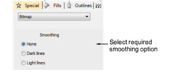
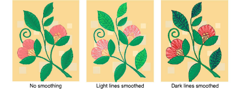
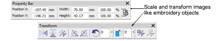

# Smooth bitmap images

When you scale or transform backdrops, the quality is sometimes reduced – e.g. thin straight lines become jagged or distorted. EmbroideryStudio allows you to smooth an image before and after scaling or transforming, making it easy to digitize.

## To smooth a bitmap image...

- Select the image and double-click to access object properties.

- Select the desired smoothing option, depending on whether the majority of lines in the image are light or dark.

- Optionally, scale and transform the image on-screen or via the Property and Transform toolbars.

## Related topics...

- [Insert bitmap images](Insert_bitmap_images)
- [Transforming Objects](../../Modifying/transform/Transforming_Objects)
