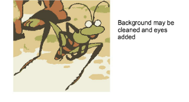
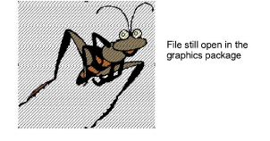

# Touch up bitmaps

Sometimes you need to edit bitmap images directly in a third-party graphics package. You would normally do this in order to eliminate backgrounds, flood-fill solid areas with color, add or reinforce outlines, or close gaps. From within EmbroideryStudio you can open images directly in MS Paint, Corel PHOTO-PAINT®, or Paint Shop Pro™. Images updated in this way are automatically re-imported into EmbroideryStudio.

## To touch up a bitmap...

1Select the image.

2Select Graphics > Edit Using >.... The image opens in the select graphics package.

3Edit the image and save.

Note: If you return to EmbroideryStudio before closing the image in the graphics package, it is overlaid with stripes.

4Return to the graphics package and select either File > Close or File > Exit & Return &lt;FileName&gt;. In EmbroideryStudio, the stripes will disappear.

## Related topics...

- [Insert bitmap images](Insert_bitmap_images)
