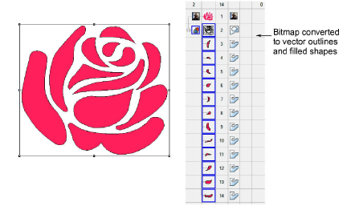
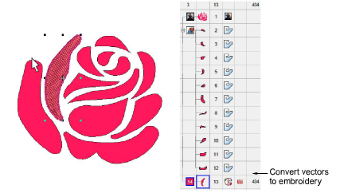

# Auto-tracing bitmap artwork

|  | Use Auto-Digitizing > Auto Trace To Vectors to convert artwork to vector objects for conversion to embroidery objects. |
| -------------------------------------- | ---------------------------------------------------------------------------------------------------------------------- |

Use Auto Trace To Vectors to create [vector](../../glossary/glossary) outlines from [bitmap](../../glossary/glossary) images. You can then convert these to embroidery objects using a variety of input methods. Auto Trace To Vectors can find holes in shapes – both inside and outside boundaries are detected.

Tip: Once digitized in EmbroideryStudio, embroidery designs can be output as vectors. These can be opened in CorelDRAW Graphics. [See also Exporting embroidery as vectors.](../../Applied/export/Exporting_embroidery_as_vectors)

## To auto-trace bitmap artwork...

1Scan or insert a bitmap image.

2Select the image and process it using the Prepare Bitmap Colors tool.

3Click the Auto Trace To Vectors icon. The design is automatically traced into vectors, both outlines and filled shapes.

Note: If the bitmap needs preliminary color reduction, clicking Auto Trace To Vectors takes you directly to the Prepare Bitmap Colors dialog.

4Select the shape/s you want to convert to embroidery and convert using any of the available techniques.

## Related topics...

- [Converting designs with CorelDRAW Graphics](../automatic/Converting_designs_with_CorelDRAW_Graphics)
- [Insert bitmap images](../bitmaps/Insert_bitmap_images)
- [Preparing images for auto-digitizing](../bitmaps/Preparing_images_for_auto-digitizing)
