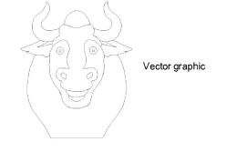
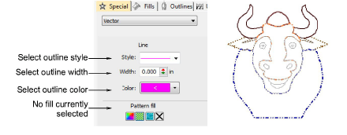
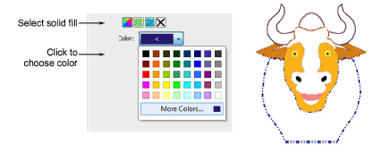
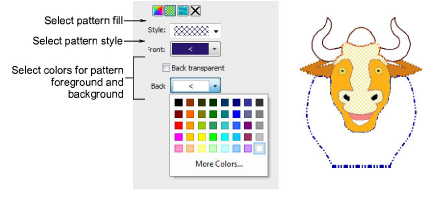
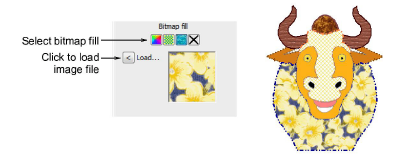

# Color vectors

|  | Use Docker > Object Properties to toggle the Object Properties docker on/off. Use it to select colors for vector outlines and fills. |
| ---------------------------------------------------- | ------------------------------------------------------------------------------------------------------------------------------------ |

EmbroideryStudio lets you set colors for vector outlines as well as fills. Coloring makes vector objects easier to interpret. For example, a solid fill color might suggest Satin or Tatami, while a fill pattern may be interpreted as [Motif Fill](../../glossary/glossary) or [Program Split](../../glossary/glossary).

## To color vectors...

1. Create or insert a vector graphic.

2. Ungroup the vector objects as necessary.

3. Select a vector object, right-click and select Properties from the popup menu. The Object Properties docker opens.

4. To change the outline color of the selected object, adjust the settings in the Line panel:

- Select an outline style from the Style list.
- Select an outline width from the Width field.
- Click Color and select an outline color from the Color dialog.

5. To fill the selected object with a solid color, select the Solid Fill icon and click the Color droplist to access the colors.

6. To fill the selected object with a pattern fill, select the Pattern Fill icon and adjust the settings:

- Select a pattern style from the droplist.
- Select a foreground color via the Front button.
- Make the background transparent as required or choose a color via the Back button.

7. To fill the selected object with a bitmap – e.g. a fabric texture – select the Bitmap Fill icon and click the Load button to insert an image file via the Open dialog.

Note: To view the changes in the [production worksheet](../../glossary/glossary), select File > Print Preview. In the Options > Design tab select the Vectors checkbox.

## Related topics...

- [Insert vector graphics](Insert_vector_graphics)
- [Customizing design reports](../../Production/reports/Customizing_design_reports)
- [Design options](../../Production/reports/Design_options)
