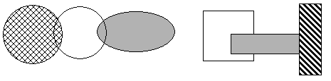
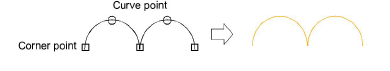
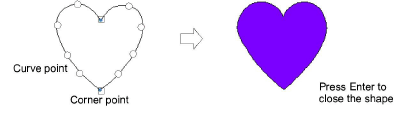
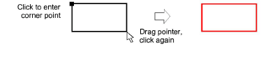
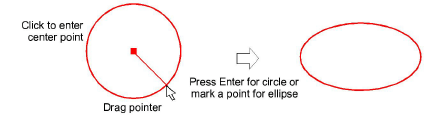

# Create vectors

|        | Use Graphics Digitizing > Digitize Open Shape to digitize open shapes. Press &lt;Ctrl&gt; to constrain.                                                         |
| ---------------------------------------------- | --------------------------------------------------------------------------------------------------------------------------------------------------------------- |
|    | Use Graphics Digitizing > Digitize Closed Shape to digitize closed shapes. Press &lt;Ctrl&gt; to constrain.                                                     |
|              | Use Graphics Digitizing > Ellipse to digitize ellipse or circle embroidery objects.                                                                             |
|          | Use Graphics Digitizing > Rectangle to digitize rectangle or square embroidery objects. Press &lt;Ctrl&gt; to constrain.                                        |
|      | Use Graphics Digitizing > Basic Shapes to digitize basic shapes. Press &lt;Ctrl&gt; to maintain aspect ratio. Press &lt;Shift&gt; to center at the first point. |
|  | Use Outline Stitch Types > Vector Outline to create vector outlines with no stitch properties applying.                                                         |
|        | Use Fill Stitch Types > Vector Fill to create vector fills with no stitch properties applying.                                                                  |

Use the Graphics Digitizing tools to create [vector objects](../../glossary/glossary) directly in EmbroideryStudio. Digitizing vector outlines and fills is like digitizing any other objects except that they have no stitch properties applying.

## To create vectors...

- Select Vector Outline or Vector Fill as your stitch type.
- Draw straight lines in your design using either Digitize Open Shape or Digitize Closed Shape digitizing tools. Enter start and end points. To constrain the line vertically, horizontally or in 15° angles, press Ctrl as you mark the end point.
- Draw lines of any shape using the same tools. Enter reference points to create the shape you want – left-click for corner points, right-click for curve points.

- When you create closed shapes with the Digitize Closed Shape drawing tool, press Enter to close the shape.

- Draw rectangles and squares using the Rectangle tool. To draw a square, hold down Ctrl as you move the pointer.

- Draw circles and ellipses using the Ellipse tool.
- To draw a perfect circle, press Enter.
- To draw an ellipse, move the pointer again, then mark a second radius point when the outline is the required size. Press Enter.

- Press Enter to close a shape.
