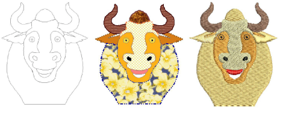

# Digitizing with Vectors

There are two fundamental design modes in EmbroideryStudio:

- Wilcom Workspace: This mode allows you to create and edit [embroidery objects](../../glossary/glossary#embroidery-objects) using an embroidery digitizing toolset.
- CorelDRAW Graphics: This mode allows you to create and edit [vector objects](../../glossary/glossary) using the CorelDRAW® Graphics Suite toolset.

Wilcom Workspace also provides tools for drawing shapes and outlines directly on screen. In this mode, you can also import or paste third-party vector graphics such as clipart for use as digitizing [backdrops](../../glossary/glossary). [Scale](../../glossary/glossary) and transform them in the same way as embroidery objects. You can also select colors for [vector object](../../glossary/glossary#vector-object) outlines and fills.

The Auto Trace To Vectors feature lets you convert scanned artwork to [vector objects](../../glossary/glossary). You can then convert these to embroidery objects using a variety of input methods.

When working with overlapping vector or embroidery objects, merge, trim or split them using Shaping tools.

CorelDRAW Graphics includes the entire suite of CorelDRAW® Graphics Suite drawing tools which offer many sophisticated techniques for drafting outlines and shapes on screen. [Vector graphics](../../glossary/glossary) so created can be directly converted to embroidery objects or even entire designs. Alternatively, you can insert or paste third-party vector graphics such as clipart for use in embroidery designs. Or, insert, paste or scan [bitmap](../../glossary/glossary#bitmap) artwork for use as digitizing templates or ‘[backdrops](../../glossary/glossary)’.

::: tip
For a full description of the CorelDRAW® Graphics Suite tools, refer to the electronic User Guide available via the MS Windows® Start > Programs group. Alternatively, use the online help available from the Help menu.
:::

This section describes how to create vector objects using the digitizing tools as well as how to import them from third-party applications. It also explains how to merge, trim and split overlapping vector or embroidery objects using the shaping tools.

## Related topics...

- [Creating vector shapes in EmbroideryStudio](Creating_vector_shapes_in_EmbroideryStudio)
- [Loading vector artwork](Loading_vector_artwork)
- [Auto-tracing bitmap artwork](Auto-tracing_bitmap_artwork)
- [Smoothing curves](Smoothing_curves)
- [Visualizing vector graphics](Visualizing_vector_graphics)
