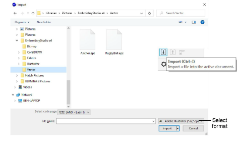
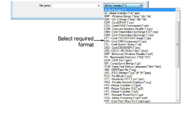
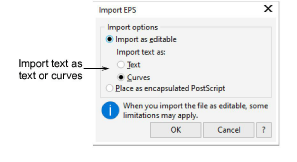

# Import vector graphics

|  | Use Mode > CorelDRAW Graphics to import, edit or create vector artwork as a backdrop for embroidery digitizing, manual or automatic.     |
| ------------------------------------------------------ | ---------------------------------------------------------------------------------------------------------------------------------------- |
|                | Use Standard > Import to import a file to the active document in CorelDRAW Graphics.                                                     |
|    | Use View > Show Vectors to show or hide any vector artwork included in the design such as CorelDRAW® clipart. Right-click for settings. |

You can load [vector](../../glossary/glossary) artwork of various formats via CorelDRAW Graphics for use as digitizing [backdrops](../../glossary/glossary) for manual or automatic digitizing. You can also use this technique to insert bitmaps.

::: info Note
CorelDRAW® needs to be registered before it can be used by EmbroideryStudio. Registration provides CorelDRAW® Standard Membership which gives you access to content – clipart, fonts, stock photos, templates – via Corel CONNECT.
:::

## To import a vector graphic...

1. Switch to CorelDRAW Graphics and click Import on the Standard toolbar.

2. Select a folder and select a file type from the Files of Type list – e.g. EPS.

3. Select a file and click Import. The Import EPS dialog opens. You are prompted to import text as pure text or as vector curves.

4. Position the cursor in the design window and press Enter.

5. Choose a digitizing technique:

- Convert [vectors](../../glossary/glossary) to embroidery: [See Convert objects with CorelDRAW Graphics for details.](../automatic/Convert_objects_with_CorelDRAW_Graphics)
- Switch to Wilcom Workspace and use the artwork as a digitizing backdrop: [See Digitizing methods for details.](../../Digitizing/input/Digitizing_methods)

::: info Note
If you cannot see the image you loaded in Wilcom Workspace, make sure Show Vectors icon is toggled on.
:::

::: tip
Locking [backdrop](../../glossary/glossary#backdrop) images holds them in place as you digitize, transform or reshape the embroidery objects near them. Locked objects can be unlocked for modification at any time.
:::

## Related topics...

- [Operating modes](../../Basics/basics/Operating_modes)
- [Change backgrounds](../../Basics/view/Change_backgrounds)
- [Grouping & locking objects](../../Modifying/combine/Grouping_locking_objects)
- [Converting designs with CorelDRAW Graphics](../automatic/Converting_designs_with_CorelDRAW_Graphics)
- [Auto-digitize individual shapes](../automatic/Auto-digitize_individual_shapes)
