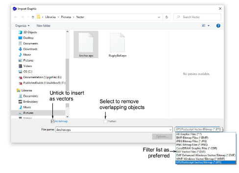
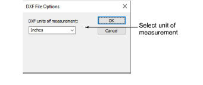
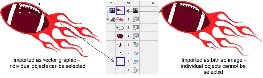
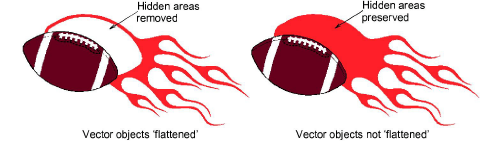

# Insert vector graphics

|  | Use Standard > Import Graphic to import vector graphic or bitmap image into current design                   |
| ---------------------------------------------- | ------------------------------------------------------------------------------------------------------------ |
|      | Use View > Show Vectors to show or hide any vector artwork included in the design. Right-click for settings. |

Vector graphics from third-party applications can be inserted into EmbroideryStudio in a variety of native and interchange vector formats. You can also import some vector graphics as [bitmaps](../../glossary/glossary). You can convert vector graphics to embroidery objects using a variety of input methods or with the [Auto-Digitizing](../../glossary/glossary) tools.

## To insert a vector graphic...

1Create a new file in EmbroideryStudio or open the design file into which you want to insert the vector graphic.

2Click the Import Graphic icon or select File > Import Graphic.

3Navigate to the graphics folder. The dialog defaults to ‘All graphic files’ which displays all supported file types – BMP, PNG, EPS, etc. Change the Files of type setting if you want to filter on a specific file type – e.g. EPS.

Note: While ‘All Graphic Files’ includes both vector and bitmap formats, for native CDR and other vector file types, use the CorelDRAW® Graphics Suite import function.

4If you are working with DXF files:

- Click Options. The DXF File Options dialog opens.

- Select Inches or Millimeters from the Units of Measurement list and click OK. If this information is not specified, the vector graphic may not display at the correct size.

5Select the As Bitmap checkbox to insert the vector graphic as a bitmap image.

Note: DXF files cannot be imported as bitmaps.

6Select the Flatten checkbox to remove any overlapping areas from the vector graphic.

7Select the Preview checkbox to see a preview of the vector graphic.

8Click Open to insert the vector graphic into the design window.

Tip: You can also paste vectors directly into EmbroideryStudio through the MS Windows® [clipboard](../../glossary/glossary).

## Related topics...

- [Operating modes](../../Basics/basics/Operating_modes)
- [Converting designs with CorelDRAW Graphics](../automatic/Converting_designs_with_CorelDRAW_Graphics)
- [Auto-digitize individual shapes](../automatic/Auto-digitize_individual_shapes)
