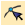
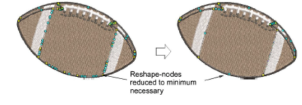
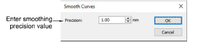

# Smoothing curves

|  | Use Reshape > Reshape Object in combination with Edit > Smooth Curves to remove unnecessary reshape-nodes from vector graphic objects. |
| ---------------------------------------------- | -------------------------------------------------------------------------------------------------------------------------------------- |

Both vector and embroidery objects contain reshape-nodes on their outlines. On shapes where the angle changes constantly, the software may insert hundreds of reshape-nodes, making reshaping difficult. The Smooth Curves command applies curve ‘smoothing’ to embroidery as well as vector objects.

## To smooth curves...

1. Select the object (or objects) to smooth.

Note: You can only smooth objects that have been ungrouped and selected. However, you can select multiple objects.

2. Optionally, click Reshape Object to view reshape-nodes around the outline.

3. Select Edit > Smooth Curves.

4. Adjust the Precision field. This value controls how closely the smoothed outline follows the original. The larger the precision value, the fewer the reshape-nodes.

5. Click OK.
