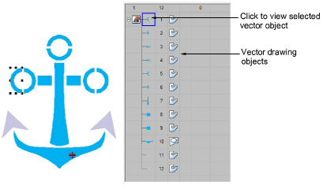
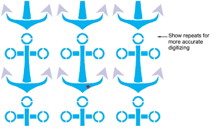

# Visualizing vector graphics

|  | Use View > Show Vectors to show or hide any vector artwork included in the design such as CorelDRAW® clipart. Right-click for settings. |
| ---------------------------------------------------- | ---------------------------------------------------------------------------------------------------------------------------------------- |
|            | Use View > Show Repeats to toggle design repeats display. Right-click for settings.                                                      |

Vectors can be viewed in a variety of ways in Wilcom Workspace. Toggle vectors on or off with the Show Vectors icon. View vectors in the Color-Object List. Click Locate to isolate selected vector objects on-screen.

Vector graphics can also be visualized using Show Repeats. This can be useful when digitizing continuous embroidery designs.

## Related topics...

- [Viewing design repeats](../../Basics/view/Viewing_design_repeats)
