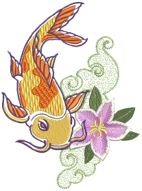

# Object-Based Embroidery

Embroidery design in EmbroideryStudio consists of turning basic artwork shapes into embroidery objects. EmbroideryStudio allows you to create embroidery objects with artwork as backdrops or by directly converting digital artwork. You can take a mixed mode approach as well, doing the bulk of the design by means of automatic conversion, followed by touch-ups and edits using the suite of EmbroideryStudio digitizing tools.

## Basic procedures

This section describes how to open EmbroideryStudio and start using the commands and tools. It also explains how to open designs as well as create new ones. It describes how to display the grid and rulers, and measure distances on screen. And it also covers how to select machine formats for different output. [See Basic Procedures for details.](../basics/Basic_Procedures)

## Viewing designs

This section explains design viewing modes as well as the various design viewing settings, including design colorways. Techniques for viewing the stitching sequence are described as well as how to selectively view design color blocks. Viewing design information, including production worksheets, is also covered. [See Viewing Designs for details.](../view/Viewing_Designs)

## Threads & charts

This section describes how to select colors from the Color toolbar as well as how to assign threads to the colors in your design. How to modify thread charts is also covered, as well as creating custom thread charts. [See Threads & Charts for details.](../threads/Threads_Charts)
