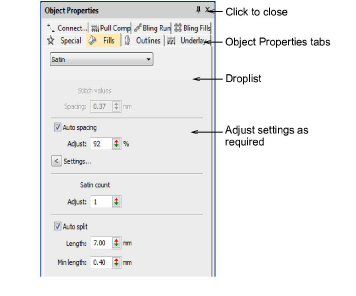
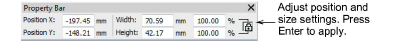

# Access object properties

|  | Use Docker > Object Properties to set properties of selected objects. |
| -------------------------------------------------------------- | --------------------------------------------------------------------- |

The most important [docker](../../glossary/glossary) is Object Properties. Use it together with the Property Bar to access the properties of selected [embroidery objects](../../glossary/glossary).

## To access object properties...

1Open the Object Properties docker by any of the following means:

- Click the Object Properties tool.
- Double-click an object in the design window.
- Right-click an object and select from the popup menu.
- Right-click an object in the Color-Object List and select from the popup menu.

2Select a tab to access the properties to adjust.

3Adjust general properties – width, height, position – by means of the Property Bar. Press Enter to apply. Press Esc to discard changes.

Tip: You can specify units of measurement when entering values into a measurement control.

## Related topics...

- [Working with object properties](../../Digitizing/properties/Working_with_object_properties)
- [Set measurement units](Set_measurement_units)
