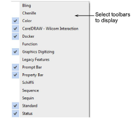

# Access toolbars

Toolbars provide quick and easy access to most EmbroideryStudio commands. Show or hide them at your convenience. As you get more familiar with the system, you may prefer menu and keyboard commands.

## To access toolbars...

- Select Window > Toolbars or right-click the docking area at the top or left of the design window. The Toolbars menu opens.

- Click to activate one or many.

## Related topics...

- EmbroideryStudio toolbars
