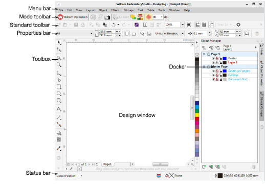

# CorelDRAW Graphics window

|  | Use Mode > CorelDRAW Graphics to import, edit or create vector artwork as a backdrop for embroidery digitizing, manual or automatic. |
| ------------------------------------------------------ | ------------------------------------------------------------------------------------------------------------------------------------ |
|        | In Graphics mode, click Mode > Show Embroidery to show or hide embroidery components.                                                |

CorelDRAW Graphics window includes the entire suite of CorelDRAW® Graphics Suite drawing tools. This mode allows you to create and edit [vector](../../glossary/glossary) graphics using the CorelDRAW Graphics toolset which offers many sophisticated techniques for drafting outlines and shapes onscreen.

In addition to the CorelDRAW® Graphics Suite toolset, CorelDRAW Graphics provides capabilities to convert [vectors](../../glossary/glossary) and vector text directly to [embroidery objects](../../glossary/glossary). Imported vector graphics or created text can be converted directly to embroidery designs. You can use CorelDRAW Graphics to insert or paste third-party vector graphics such as clipart for use in embroidery designs. Alternatively, insert, paste or scan [bitmap](../../glossary/glossary) artwork for use as digitizing templates or ‘[backdrops](../../glossary/glossary)’. Here are some of the prominent CorelDRAW Graphics interface elements.

| Element          | Description                                                                                                                                        |
| ---------------- | -------------------------------------------------------------------------------------------------------------------------------------------------- |
| Menu bar         | This contains application menus such as File, Edit, View, etc.                                                                                     |
| Mode toolbar     | This contains the universal tools and icons which are visible in both Wilcom Workspace and CorelDRAW Graphics windows.                             |
| Standard toolbar | This contains commonly used tools and commands which are specific to and only visible in CorelDRAW Graphics.                                       |
| Properties bar   | This contains the commands and controls that relate to the active tool in the Toolbox or active object in the design window in CorelDRAW Graphics. |
| Toolbox          | This contains the drawing/editing tools specific to and visible only in CorelDRAW Graphics.                                                        |
| Design window    | This contains the main work area where you create and edit graphics objects as well as embroidery objects when you switch to Wilcom Workspace.     |
| Color palette    | This contains the graphics color palette which is specific to and only visible in CorelDRAW Graphics.                                              |
| Docker           | In CorelDRAW Graphics, this contains graphics-specific dockers.                                                                                    |
| Status bar       | This contains current status information visible only in the CorelDRAW Graphics.                                                                   |

For a detailed description of the CorelDRAW® Graphics Suite interface, refer to the electronic User Guide available via the MS Windows® Start > Programs group. Alternatively, use the online help available from the Help menu.

Note: CorelDRAW® needs to be registered before it can be used by EmbroideryStudio. Registration provides CorelDRAW® Standard Membership which gives you access to content – clipart, fonts, stock photos, templates – via Corel CONNECT. It also gives you access to the latest CorelDRAW® updates.

## Related topics...

- [Loading bitmap artwork](../../Automatic/bitmaps/Loading_bitmap_artwork)
- [Convert objects with CorelDRAW Graphics](../../Automatic/automatic/Convert_objects_with_CorelDRAW_Graphics)
