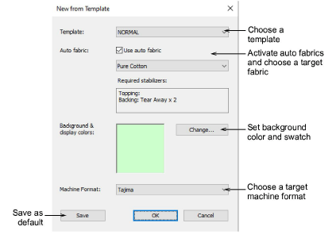

# Create designs from templates

|  | Use Standard > New Design to start a blank design based on the currently selected template. Hold down Shift and click to open New from Template dialog. |
| -------------------------- | ------------------------------------------------------------------------------------------------------------------------------------------------------- |

Templates are special files used to store styles, [default properties](../../glossary/glossary), as well as fabric settings. Although the NORMAL template settings are suitable for a range of fabrics, selecting an auto fabric further adjusts settings.

## To create a design based on a template...

1. Select File > New from Template or, holding down the Shift key, click New Design. The New from Template dialog opens.

2. Select a template from the droplist. When you create a file based on a template, its settings are copied to the new design.

3. If you want, additionally, to use fabric settings, tick the checkbox. From the droplist, choose a fabric type nearest the one you intend to work with.

4. Optionally, choose a background to match the selected auto fabric.

5. Choose a target machine from the droplist. You normally decide which [machine format](../../glossary/glossary) to use before you start. However, formats can be changed at any time.

Tip: You can customize or add formats to suit the target machine.

6. Click OK to accept. A blank design opens in the design window based on the selected template. Settings will apply to all newly created [embroidery objects](../../glossary/glossary). Any selected fabric is displayed in the Status Bar.

Tip: The New from Template option is activated by default. Turn it off if you prefer work without predefined fabric settings.

## Related topics...

- [Working with templates](../../Digitizing/properties/Working_with_templates)
- [Working with fabrics](../../Digitizing/properties/Working_with_fabrics)
- [Other general options](../../Setup/settings/Other_general_options)
- [Machine Formats](../../Setup/machines/Machine_Formats)
