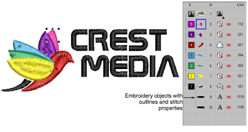

# Design files

Design files, also known as ‘all-in-one’ files, are high-level formats which contain object outlines, [object properties](../../glossary/glossary#object-properties) and stitch data. When you open a design file in the software, corresponding stitch types, digitizing methods and effects are applied.

Design files can be [scaled](../../glossary/glossary), transformed and reshaped without affecting stitch density or quality. After modification, you can choose to save your design to [EMB](../../glossary/glossary) format, or to a different format altogether.

::: info Note
Some design files, such as Wilcom INP and Gunold PCH, contain incomplete information. Old format ESD designs are somewhere between an [design file](../../glossary/glossary#design-file) and a machine file. They contain stitch data, information about selected stitch types, densities, and [machine functions](../../glossary/glossary). They do not, however, contain information about shapes and lines. ESD files require object/outline [recognition ](../../glossary/glossary)if you want to perform object editing in EmbroideryStudio.
:::
