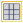
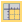
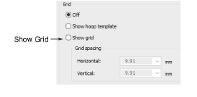
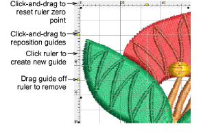
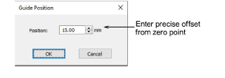
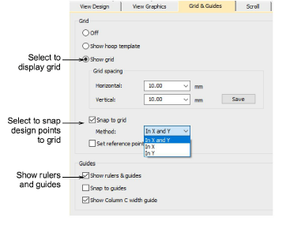

# Display grids, rulers & guides

|                        | Click View > Show Grid to show or hide the grid. Right-click for settings.                       |
| ---------------------------------------------------------- | ------------------------------------------------------------------------------------------------ |
|  | Click View > Show Rulers and Guides to show or hide rulers and guides. Right-click for settings. |
|            | Drag the ruler zero point to reset a new ruler zero point.                                       |

Use grid lines to help accurately align or size [embroidery objects](../../glossary/glossary). Default grid spacing is 10mm x 10mm. Invoke rulers to accurately position and scale objects. The unit of measurement – mm or inches – defaults to the regional settings in the MS Windows® Control Panel.

## To display grids, rulers and guides...

- Click the Show Grid icon or press Shift+G. Right-click for settings. You can change grid spacing, select a reference point and turn Snap to Grid on or off in the Options dialog.

- Click the Show Rulers & Guides icon or press Ctrl+R.

- Reset the ruler zero point by clicking and dragging the button in the top left-hand corner of the ruler.
- To create a guide, click either ruler – horizontal or vertical – and click-and-drag it into position. Multiple guides can be created and just as easily removed.
- For more accurate positioning of guides, double-click the yellow handle. In the Guide Position dialog, enter a precise distance from zero point and click OK.

- To remove a guide, drag the yellow guide handle off the design window.
- Optionally, turn on the Snap to... feature via the Options dialog.

- You can also change the color of grid and guidelines via the Background & Display Colors dialog.

## Related topics...

- [Grid display options](../../Setup/settings/Grid_display_options)
- [Change display colors](../view/Change_display_colors)
- [Selecting hoops manually](../../Production/hoops/Selecting_hoops_manually)
