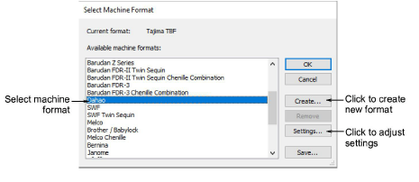

# Embroidery machine formats

Different embroidery machines speak different languages. They have their own control commands for the various [machine functions](../../glossary/glossary). When you create a design, you need to select a format corresponding to the embroidery machine you intend to use. EmbroideryStudio uses the format to translate digitized designs into a specific machine-readable form. You don’t, however, need to change a design’s ‘native machine format’ in order to output to a different machine. If a selected machine format does not support a particular function in the design, it is simply ignored on output.

## To select a machine format...

- Select Design > Select Machine Format.

- Select the required machine format from the list.

::: info Note
You can change the machine format itself if machine values do not correspond precisely to your particular machine. Or you can create a new format based on a selected one.
:::

## Related topics...

- [Supported machine types](../../Management/formats/Supported_machine_types)
- [Embroidery Output](../../Production/output/Embroidery_Output)
- [Machine Formats](../../Setup/machines/Machine_Formats)
- [Selecting sequin mode](../../Applied/sequin_basics/Selecting_sequin_mode)
- [Custom machine formats](../../Setup/machines/Custom_machine_formats)
