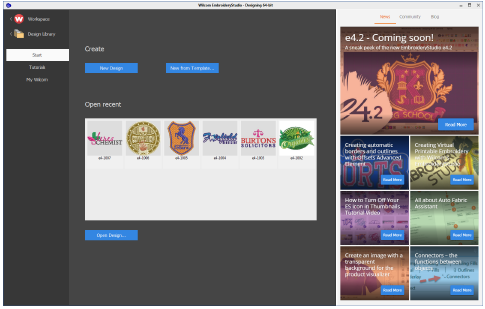

# Home screen

|  | Click Mode > Home to return to the Home screen to get started with a new design, or access tutorials and other product information. |
| ---------------------------- | ----------------------------------------------------------------------------------------------------------------------------------- |

The Home screen loads when EmbroideryStudio starts, offering you quick access to recently opened designs, as well as value-add content, including tutorial videos and the latest Community Forum and Product Blog posts. You can also browse ‘My Wilcom’ which provides details of your Wilcom license, including product level, version, as well as any compatible or enabled Elements.

::: tip
You can deactivate the Home screen from running on startup via the Options dialog. [See Other general options for details.](../../Setup/settings/Other_general_options)
:::

## Related topics...

- [Open designs](Open_designs)
- [Create designs from templates](Create_designs_from_templates)
